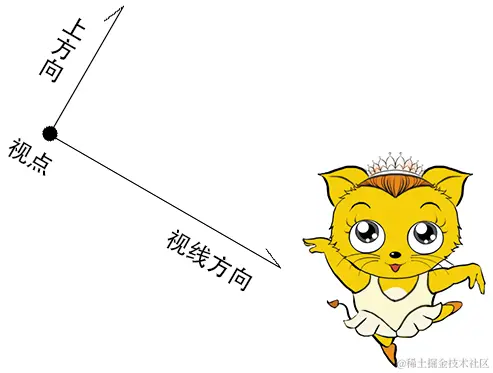

# 视图矩阵

## 概述

+ 视图矩阵是用于确定相机角度和位置的矩阵

## 相机的定义

+ 视点：相机的位置
+ 视线方向：相机所看的方向
+ 上方向：相机绕视线转动的方向

  

## 相对运动

+ 当相机与它所拍摄的物体同时运动的时候，相机所拍摄的画面不会有任何改变

  

+ 因此，我们可以默认相机的视点就在零点，相机看向-z方向，其上方向就是y轴。

+ 当我我们改变的相机的视点、视线和上方向的时候，只要相对的去改变场景中的物体即可。

+ 而这个相对的去改变场景中的物体的矩阵，就是视图矩阵

  

+ 通过上面原理，我们可以知道，想要计算视图矩阵，只要让其满足以下条件即可

  1. 把视点e(ex,ey,ez)对齐到 O点上
  2. 把视线c(cx,cy,cz) 旋转到-z 轴上
  3. 把上方向b(bx,by,bz) 旋转到y 轴上
  4. 把c与b的垂线a(ax,ay,az) 旋转到x 轴上

## 正交矩阵的旋转

