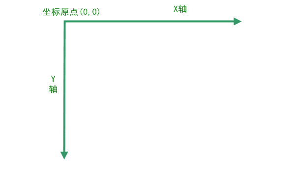
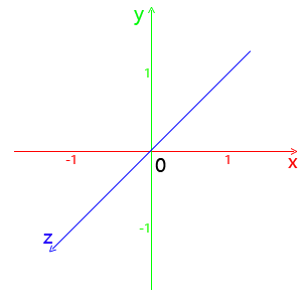
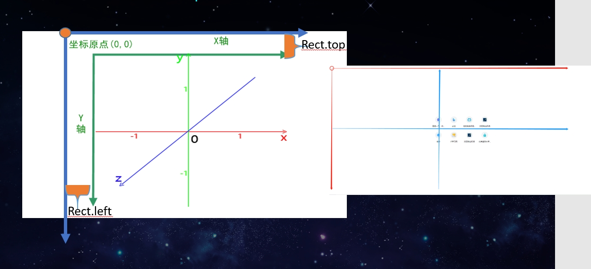

# 坐标系

## cancas 坐标系

+ 在2D绘图环境中的坐标系统，默认情况下是与窗口坐标系统相同，它以canvas的左上角为坐标原点，沿x轴向右为正值，沿y轴向下为正值
+ 其中canvas坐标的单位都是 "px"

  

## webGL 坐标系

+ WebGL使用的是正交右手坐标系，且每个方向都有可使用的值的区间，超出该矩形区间的图像不会绘制：

  + x轴最左边为-1，最右边为1；
  + y轴最下边为-1，最上边为1；
  + z轴朝向你的方向最大值为1，远离你的方向最大值为-1；

+ 注：这些值与Canvas的尺寸无关，无论Canvas的长宽比是多少，WebGL的区间值都是一致的

  

## cancas 坐标系 与 webGL 坐标系

+ cancas 坐标系 与 webGL 坐标系 关系

  
