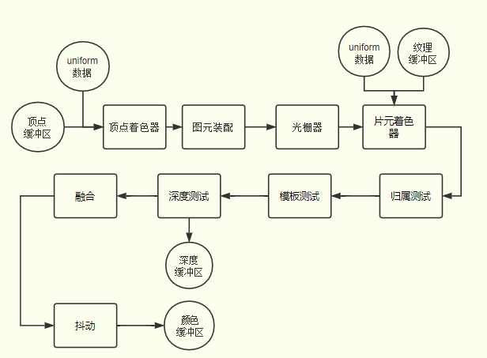

# 渲染管线

## 概述

+ 渲染管线就像一条流水线，由一系列具有特定功能的数字电路单元组成，下一个功能单元处理上一个功能单元生成的数据，逐级处理数据

+ 顶点着色器和片元着色器是可编程的功能单元，拥有更大的自主性，还有光栅器、深度测试等不可编程的功能单元
+ CPU会通过WebGL API和GPU通信，传递着色器程序和数据，GPU执行的着色器程序可以通过 `useProgram` 方法切换，传递数据就是把CPU主存中的数据传送到GPU的显存中

  
