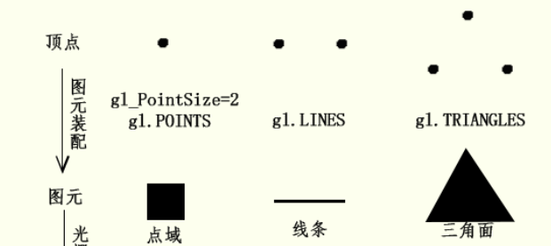

# 图元装饰

## 概述

+ 顶点变换后的操作是图元装配(primitive assembly)，硬件上具体是怎么回事不用思考，从程序的角度来看，就是绘制函数drawArrays()或drawElements()第一个参数绘制模式mode控制顶点如何装配为图元，

  + `gl.LINES` 的定义的是把两个顶点装配成一个线条图元
  + `gl.TRIANGLES` 定义的是三个顶点装配为一个三角面图元
  + `gl.POINTS` 定义的是一个点域图元

  
