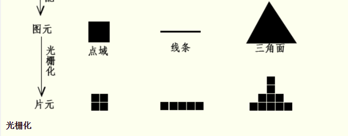
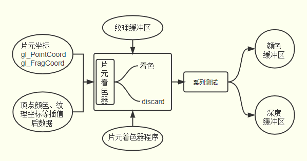

# 基础

## 概述

+ 片元着色器和顶点着色器一样是GPU渲染管线上一个可以执行着色器程序的功能单元，顶点着色器处理的是逐顶点处理顶点数据，片元着色器是逐片元处理片元数据

+ 通过给内置变量 `gl_FragColor` 赋值可以给每一个片元进行着色， 值可以是一个确定的RGBA值，可以是一个和片元位置相关的值，也可以是插值后的顶点颜色

+ 除了给片元进行着色之外，通过关键字discard还可以实现哪些片元可以被丢弃，被丢弃的片元不会出现在帧缓冲区，自然不会显示在canvas画布上

  
  
