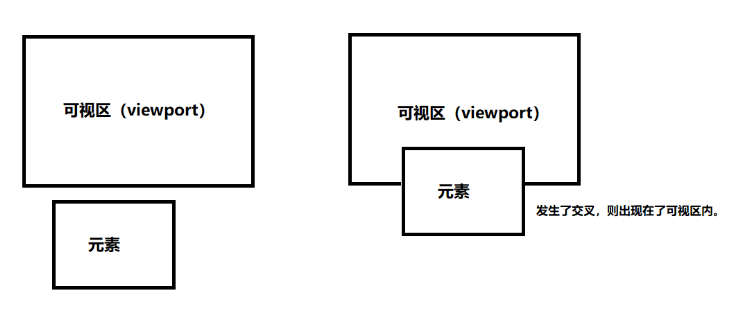
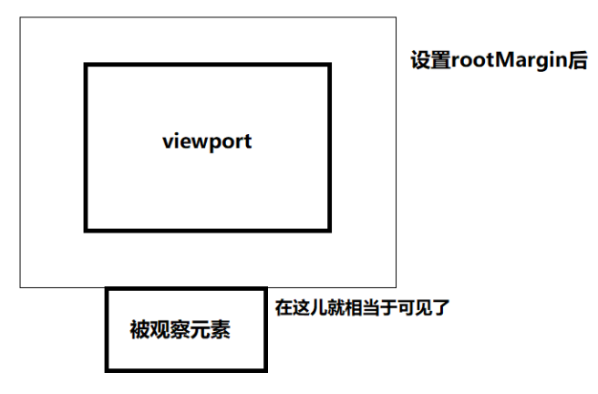

# 图片懒加载

## IntersectionObserve

+ IntersectionObserve 是浏览器提供的一个原生构造函数，它也被称作交叉观察器
+ 它可以观察我们的元素是否可见，也就是是否和可视区发生交叉

  

## 语法

+ `let IO = new IntersectionObserver(callback, options);`

+ callback  会接收两个参数

  + entries

    + time：可见性发生变化的时间，是一个高精度时间戳，单位为毫秒
    + target：被观察的目标元素，是一个 DOM 节点对象
    + rootBounds：根元素的矩形区域的信息，getBoundingClientRect()方法的返回值，如果没有根元素（即直接相对于视口滚动），则返回 null
    + boundingClientRect：目标元素的矩形区域的信息
    + isIntersecting：目标元素当前是否可见 Boolean 值 可见为 true
    + intersectionRect：目标元素与视口（或根元素）的交叉区域的信息
    + intersectionRatio：目标元素的可见比例，即 intersectionRect 占 boundingClientRect 的比例，完全可见时为 1，完全不可见时小于等于 0

  + observer: 它返回的是被调用的 IntersectionObserve 实例，我们通常无需操作

+ options 是一个对象的形式，它主要一些配置信息，主要配置项有如下几个

  + root：主要用来配置被观察元素是相对于谁可见和不可见，如果不配置，则默认的是浏览器视口。
  + threshold：主要用来配置两个元素的交叉比例，它是一个数组，用于决定在什么时候触发回调函数。
  + rootMargin：用来改变可视区域的范围，假如我们可视区域大小是 300x300，可以通过该参数改变可视区域大小，但是实际像素值并没有变，优点类似于我们上拉加载更多场景：当距离底部多少多少像素的时候就加载

  ```js
  let viewport = document.getElementById("viewport"); // 可视区域

  let options = {
    root: viewport,
    threshold: [0, 0.5, 1],
    rootMargin: '30px 100px 20px'
  }
  ```

  

## 示例方法

+ 初始化实例后，我们就可以调用实例方法了。IntersectionObserver 实例常用的方法常主要有下面几个：

  + IO.observe([element])：使用该方法后代表我们开始观察某个元素了，它接收一个元素节点作为参数，也就是被观察元素。
  + IO.unobserve([element])：该方法用于停止观察某元素，同样接收一个元素节点作为参数。
  + IO.disconnect()：该方法用于关闭观察器。

## 示例

+ 查看 entries 和 observe

  ```html
  <head>
    <style>
      .viewport {
        width: 300px;
        height: 200px;
        border: 1px solid blue;
        overflow: auto;
      }


      .box1 {
        height: 600px;
        width: 100%;
      }


      .observed {
        width: 100px;
        height: 100px;
        border: 1px solid green;
      }
    </style>

  </head>

  <body>
    <div class="viewport" id="viewport">
      <div class="box1">
        <div class="observed" id="observed"></div>
      </div>
    </div>
  </body>
  <script>
    let viewport = document.getElementById("viewport"); // 可视区域
    let observed = document.getElementById("observed"); // 被观察元素
    let options = {
      root: viewport, // 指定可视区元素
    }
    let IO = new IntersectionObserver(IOCallback, options); // 初始化实例
    IO.observe(observed); // 开始观察

    // 回调函数
    function IOCallback(entries, observer) {
      console.info("entries", entries);
      console.info("observer", observer);
    }
  </script>
  ```

+ 图片懒加载

  + 先确定可视区窗口
  + 为所有 img 标签添加一个自定义 data-src 属性，用来存放图片真正路径
  + 利用 IntersectionObserve 观察每一张图片是否进入可视区内
  如果进入可视区内，则将图片的 src 路径替换为真正的 data-src 路径

  ```js
  <head>
    <style>
      .viewport {
        width: 300px;
        height: 200px;
        border: 1px solid blue;
        overflow: auto;
      }


      .box1 {
        height: 600px;
        width: 100%;
      }


      .observed {
        width: 100px;
        height: 100px;
        border: 1px solid green;
      }


      .imgs {
        width: 100px;
        height: 100px;
      }
    </style>

  </head>

  <body>
    <div class="viewport" id="viewport">
      <div class="box1">
        
        
        
        
        
        
        
        
        
        
        
        
        
        
        
        
      </div>
    </div>
  </body>
  <script>
    let viewport = document.getElementById("viewport"); // 可视区域
    let imgList = document.querySelectorAll(".imgs"); // 被观察元素

    let options = {
      root: viewport
    }
    let IO = new IntersectionObserver(IOCallback, options);

    // 循环所有 img 标签，使它被观察
    imgList.forEach((item) => {
      IO.observe(item)
    })

    // 回调函数
    function IOCallback(entries, observer) {
      // 循环所有观察元素
      entries.forEach(item => {
        // 如果出现在可视区内，则替换 src
        if (item.isIntersecting) {
          console.info("出现在可视区内")
          item.target.src = item.target.dataset.src  // 替换 src
          IO.unobserve(item.target)  // 停止观察当前元素 避免不可见时候再次调用 callback 函数
        }
      });
    }
  </script>
  ```
