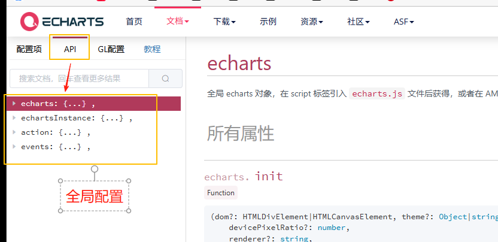

# 基础

## 概述

+ 官网 https://echarts.apache.org/zh/index.html

## 文档理解

+ API：全局配置

  

+ 配置项：普通图表

  + 来自全局配置中的 echartsInstance 属性之 setOption

+ GL配置：3D图表配置

  + 来自全局配置中的 echartsInstance 属性之 setOption
