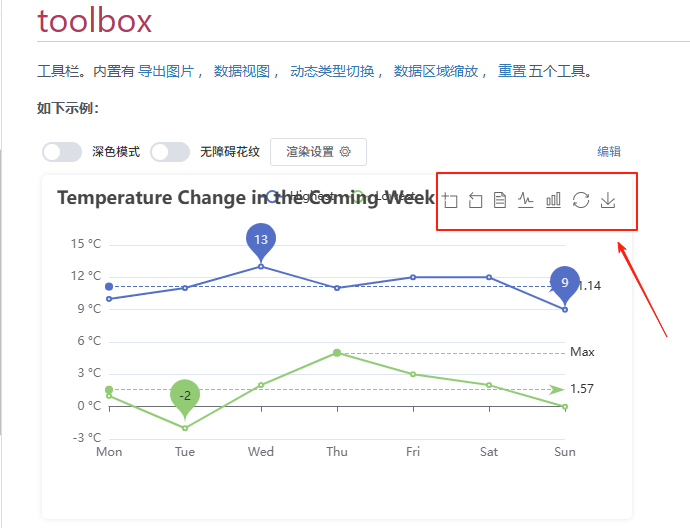

# toolbox

## 概述

+ 工具栏

  + 内置有导出图片
  + 数据视图
  + 动态类型切换
  + 数据区域缩放
  + 重置

  

## 属性

+ id
+ show `boolean`

  + 是否显示工具栏组件 默认 `true`

+ orient `string`

  工具栏 icon 的布局朝向

  + 可选：

  + 'horizontal' 默认值
  + 'vertical'

+ itemSize `number`

  + 工具栏 icon 的大小 默认 `15`

+ itemGap `number`

  + 默认 `8`
  + 工具栏 icon 每项之间的间隔
  + 横向布局时为水平间隔，纵向布局时为纵向间隔

+ showTitle `boolean`

  + 默认 `true`
  + 是否在鼠标 hover 的时候显示每个工具 icon 的标题

+ feature 详见下面
+ iconStyle
+ emphasis
+ zlevel
+ z
+ left
+ tio
+ right
+ bottom
+ width
+ height
+ tooltip

## feature

+ 各工具配置项 `Object`

+ 除了各个内置的工具按钮外，还可以自定义工具按钮

+ 注意，自定义的工具名字，只能以 my 开头

  ```js
  {
    toolbox: {
      feature: {
        myTool1: {
          show: true,
          title: '自定义扩展方法1',
          icon: 'path://M432.45,595.444c0,2.177-4.661,6.82-11.305,6.82c-6.475,0-11.306-4.567-11.306-6.82s4.852-6.812,11.306-6.812C427.841,588.632,432.452,593.191,432.45,595.444L432.45,595.444z M421.155,589.876c-3.009,0-5.448,2.495-5.448,5.572s2.439,5.572,5.448,5.572c3.01,0,5.449-2.495,5.449-5.572C426.604,592.371,424.165,589.876,421.155,589.876L421.155,589.876z M421.146,591.891c-1.916,0-3.47,1.589-3.47,3.549c0,1.959,1.554,3.548,3.47,3.548s3.469-1.589,3.469-3.548C424.614,593.479,423.062,591.891,421.146,591.891L421.146,591.891zM421.146,591.891',
          onclick: function (){
            alert('myToolHandler1')
          }
        },
        myTool2: {
          show: true,
          title: '自定义扩展方法',
          icon: 'image://https://echarts.apache.org/zh/images/favicon.png',
          onclick: function (){
            alert('myToolHandler2')
          }
        }
      }
    }
  }
  ```
