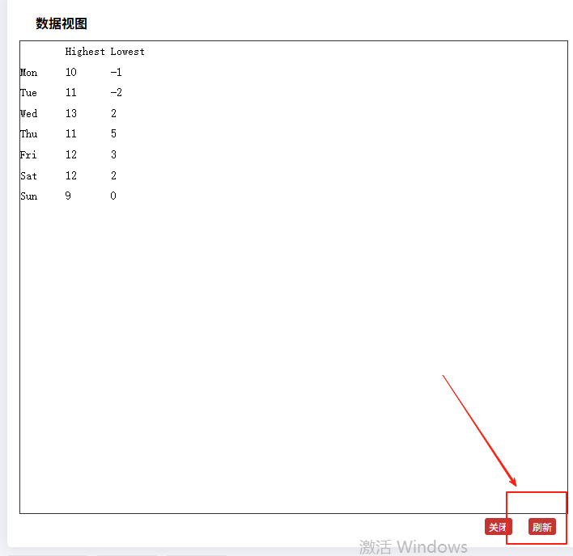

# dataView 数据视图工具

### feature 之 dataView 数据视图工具

+ `Object`
+ 数据视图工具，可以展现当前图表所用的数据，编辑后可以动态更新

## 属性

+ show

  + 是否显示该工具

+ title
+ icon
+ itonStyle
+ emphasis
+ readOnly `boolean`

  + 默认 `false` 表示可以编辑
  + 是否不可编辑（只读）

+ optionToContent `Function`

  + 自定义 dataView 展现函数，用以取代默认的 textarea 使用更丰富的数据编辑。可以返回 dom 对象或者 html 字符串

  ```js
  (option:Object) => HTMLDomElement|string
  ```

  ```js
  optionToContent: function(opt) {
    var axisData = opt.xAxis[0].data;
    var series = opt.series;
    var table = '<table style="width:100%;text-align:center"><tbody><tr>'
                 + '<td>时间</td>'
                 + '<td>' + series[0].name + '</td>'
                 + '<td>' + series[1].name + '</td>'
                 + '</tr>';
    for (var i = 0, l = axisData.length; i < l; i++) {
        table += '<tr>'
                 + '<td>' + axisData[i] + '</td>'
                 + '<td>' + series[0].data[i] + '</td>'
                 + '<td>' + series[1].data[i] + '</td>'
                 + '</tr>';
    }
    table += '</tbody></table>';
    return table;
  }
  ```

+ contentToOption

  + 点击刷新的时候触发

    

+ lang

  + 数据视图上有三个话术，默认是 `['数据视图', '关闭', '刷新']`

+ backgroundColor
+ textareaColor
+ textareaBorderColor
+ textColor
+ buttonColor
+ buttonTextColor
