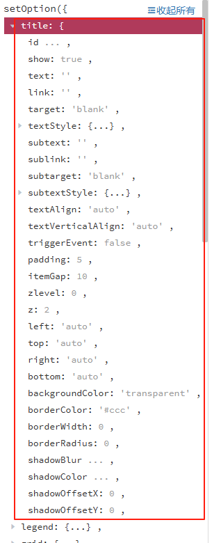
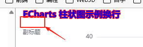

# title属性

## title属性

+ 标题组件，包含主标题和副标题

  

  ```js
  // 基于准备好的dom，初始化echarts实例
  var myChart = echarts.init(document.querySelector(".title")!);

  // 绘制图表
  myChart.setOption({
    title: {
      id:"",
      text: "ECharts 柱状图示例",
    },

    // y 轴 配置
    yAxis: {},

    // 系列列表
    series: [
     ....
    ],
  });
  ```

## title属性的属性

+ id `string` ： 组件 ID。默认不指定。指定则可用于在 option 或者 API 中引用组件
+ show `boolean` ：是否显示标题组件。默认 `true`

+ 主标题相关设置详见下面
+ 副标题相关设置详见下面

+ textAlign `string` :整体（包括 text 和 subtext）的水平对齐

  + 两个标题内容不一样，有可能被截断。建议使用默认值

  + 可选值：'auto'、'left'、'right'、'center'
  + 默认 'auto'

+ textVerticalAlign `string` : 整体（包括 text 和 subtext）的垂直对齐

  + 建议使用默认值

  + 可选值：'auto'、'top'、'bottom'、'middle'
  + 默认 'auto'

+ triggerEvent `boolean` : 是否触发事件
+ padding `number | Array` :

  + 标题内边距，单位px
  + 默认各方向内边距为5，接受数组分别设定上右下左边距

  ```js
  // 设置内边距为 5
  padding: 5

  // 设置上下的内边距为 5，左右的内边距为 10
  padding: [5, 10]

  // 分别设置四个方向的内边距
  padding: [
    5,  // 上
    10, // 右
    5,  // 下
    10, // 左
  ]
  ```

+ itemGap `number` : 主副标题之间的间距

  + 默认 10

    

+ zlevel `number` : 所有图形的 zlevel 值

  + 创建新的 Canvas
  + zlevel用于 Canvas 分层，不同zlevel值的图形会放置在不同的 Canvas 中，Canvas 分层是一种常见的优化手段
  + 我们可以把一些图形变化频繁（例如有动画）的组件设置成一个单独的zlevel
  + 需要注意的是过多的 Canvas 会引起内存开销的增大，在手机端上需要谨慎使用以防崩溃

  + zlevel 大的 Canvas 会放在 zlevel 小的 Canvas 的上面

+ z `number` : 类似于 css 中的 `z-index`

  + 组件的所有图形的z值
  + 控制图形的前后顺序。z值小的图形会被z值大的图形覆盖
  + z相比zlevel优先级更低，而且不会创建新的 Canvas

+ left `number | string` :

  + title 组件离容器左侧的距离
  + left 的值可以是像 20 这样的具体像素值，可以是像 '20%' 这样相对于容器高宽的百分比，也可以是 'left', 'center', 'right'
  + 如果 left 的值为 'left', 'center', 'right'，组件会根据相应的位置自动对齐
  + 默认 `auto`

+ top `number | string` :

  + title 组件离容器上侧的距离
  + top 的值可以是像 20 这样的具体像素值，可以是像 '20%' 这样相对于容器高宽的百分比，也可以是 'top', 'middle', 'bottom'
  + 如果 top 的值为 'top', 'middle', 'bottom'，组件会根据相应的位置自动对齐。
  + 默认 `auto`

+ right `number | string` :

  + title 组件离容器右侧的距离
  + right 的值可以是像 20 这样的具体像素值，可以是像 '20%' 这样相对于容器高宽的百分比
  + 默认 `auto`

+ bottom `number | string` :

  + title 组件离容器下侧的距离
  + bottom 的值可以是像 20 这样的具体像素值，可以是像 '20%' 这样相对于容器高宽的百分比
  + 默认 `auto`

+ backgroundColor `Color` : 标题背景色，默认透明 `transparent`

  + 颜色可以使用 RGB 表示，比如 `'rgb(128, 128, 128)'`
  + 如果想要加上 alpha 通道，可以使用 RGBA，比如 `'rgba(128, 128, 128, 0.5)'`
  + 也可以使用十六进制格式，比如 `'#ccc'`

+ borderColor`Color` : 标题的边框颜色。支持的颜色格式同 backgroundColor 默认 `#ccc`

+ borderWidth `number` : 标题的边框线宽 默认为 `0`
+ borderRadius `number | Array` : 圆角半径，单位px，支持传入数组分别指定 4 个圆角半径

  ```js
  borderRadius: 5, // 统一设置四个角的圆角大小
  borderRadius: [5, 5, 0, 0] //（顺时针左上，右上，右下，左下）
  ```

+ shadowBlur `number` :  图形阴影的模糊大小

  + 该属性配合 shadowColor,shadowOffsetX, shadowOffsetY 一起设置图形的阴影效果
  + 注意：此配置项生效的前提是，设置了 show: true 以及值不为 transparent 的背景色 backgroundColor。

  ```js
  {
    shadowColor: 'rgba(0, 0, 0, 0.5)',
    shadowBlur: 10
  }
  ```

+ shadowColor `Color` : 阴影颜色。支持的格式同color

  + 注意：此配置项生效的前提是，设置了 `show: true`

+ shadowOffsetX `number` : 阴影水平方向上的偏移距离

  + 注意：此配置项生效的前提是，设置了 `show: true`

+ shadowOffsetY `number` : 阴影垂直方向上的偏移距离

  + 注意：此配置项生效的前提是，设置了 `show: true`
