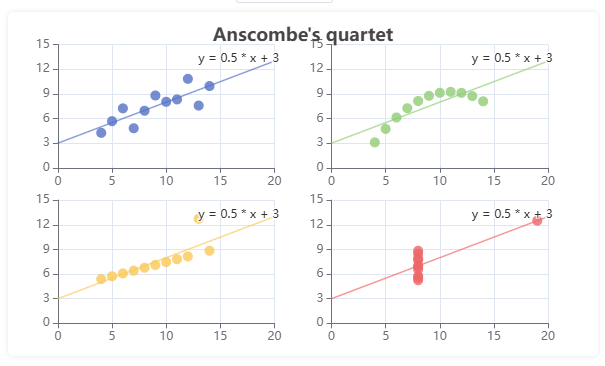
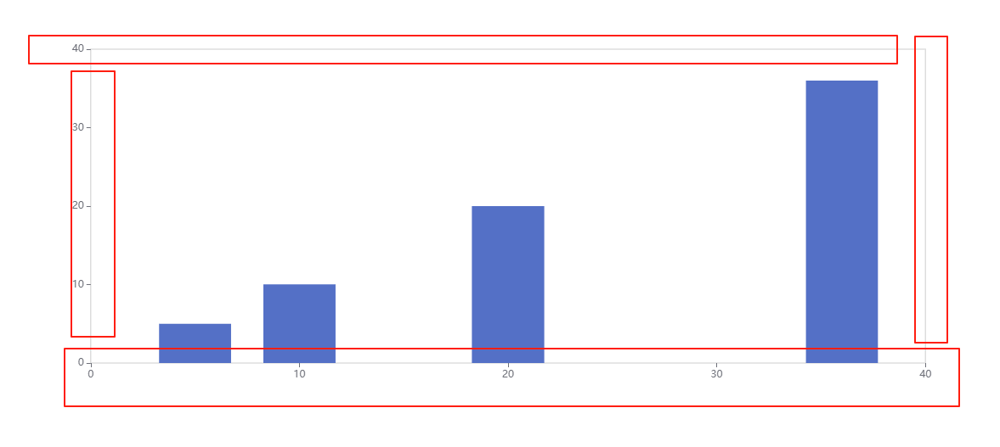
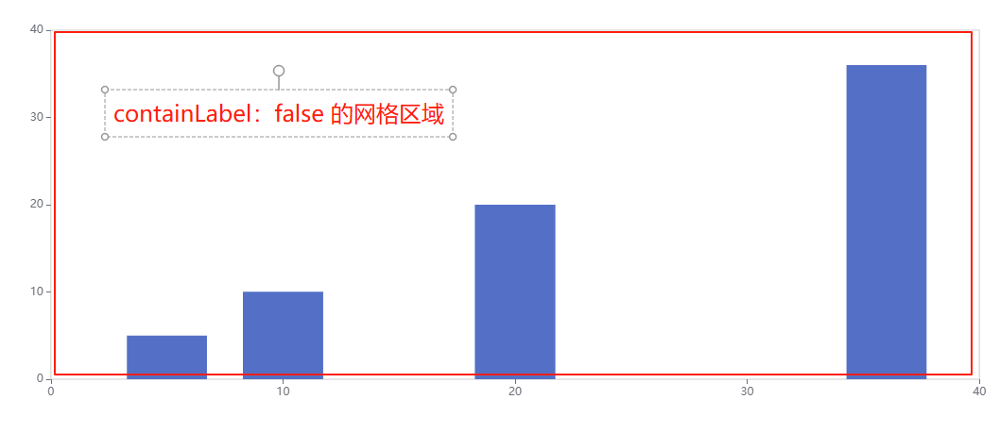
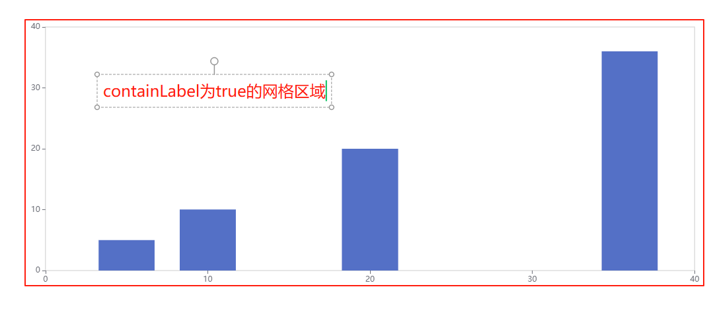
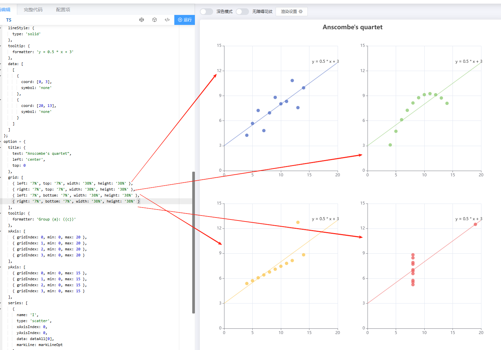

# grid 网格

## 概述

+ 直角坐标系内绘图网格，单个 grid 内最多可以放置上下两个 X 轴，左右两个 Y 轴
+ 可以在网格上绘制折线图，柱状图，散点图（气泡图）

  

## 属性

+ id
+ show 是否显示直角坐标系网格

  + 默认 `false`

    ```js
    myChart.setOption({
      grid: {
        // 显示
        show: true,
      },

      // x 轴 配置
      xAxis: {
        splitLine: {
          show: false, // 坐标轴上的刻度线不显示
        },
        axisLine: {
          show: false, // 坐标轴上的轴线
        },
      },

      // y 轴 配置
      yAxis: {
        splitLine: {
          show: false, // 坐标轴上的刻度线不显示
        },
        axisLine: {
          show: false,
        },
      },

      // 系列列表
      series: [
        {
          name: "1号销量",
          type: "bar", // 图标的类型
          data: [5, 20, 36, 10, 10, 20], // 图标的数据
        },
      ],
    });
    ```

    

+ zlevel
+ z
+ left
+ top
+ right
+ bottom
+ width
+ height
+ containLabel 详见下面
+ backgroundColor 网格背景色

  + 默认透明 `transparent`
  + 此配置项生效的前提是，设置了 show: true。

+ borderColor
+ borderWidth
+ shadowBlur
+ shadowColor
+ shadowOffsetX
+ shadowColor
+ tooltip

## grid 之 containLabel

+ 默认 `false`
+ grid 区域是否包含坐标轴的刻度标签

  
  

+ containLabel 为 `false` 的时候：

  + grid.left grid.right grid.top grid.bottom grid.width grid.height 决定的是由坐标轴形成的矩形的尺寸和位置
  + 这比较适用于多个 grid 进行对齐的场景，因为往往多个 grid 对齐的时候，是依据坐标轴来对齐的

+ containLabel 为 `true` 的时候：

  + grid.left grid.right grid.top grid.bottom grid.width grid.height 决定的是包括了坐标轴标签在内的所有内容所形成的矩形的位置
  + 这常用于『防止标签溢出』的场景，标签溢出指的是，标签长度动态变化时，可能会溢出容器或者覆盖其他组件。

## 显示多个 grid

+ 在 grid中设置多个

  
