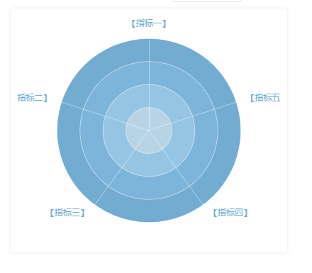
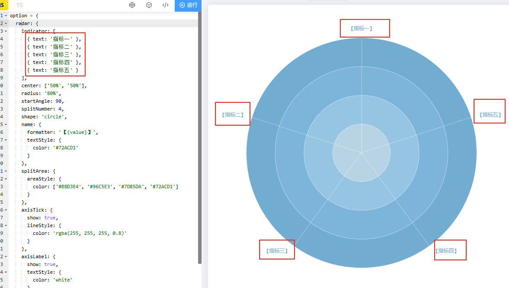
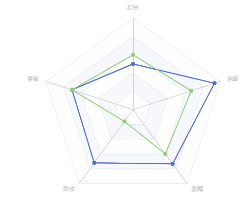

# radar

## 概述

+ 雷达图坐标系组件，只适用于雷达图。该组件等同 ECharts 2 中的 polar 组件。因为 3 中的 polar 被重构为标准的极坐标组件，为避免混淆，雷达图使用 radar 组件作为其坐标系

+ 雷达图坐标系与极坐标系不同的是它的每一个轴（indicator 指示器）都是一个单独的维度，可以通过 name、axisLine、axisTick、axisLabel、splitLine、 splitArea 几个配置项配置指示器坐标轴线的样式

  

## 属性

+ id
+ zlevel
+ z
+ center
+ radius
+ startAngle
+ axisName
+ splitNumber
+ shape
+ scale
+ silent
+ triggerEvent
+ axisLine
+ axisTick
+ axisLabel
+ splitLine
+ splitArea
+ indicator 雷达图的指示器，用来指定雷达图中的多个变量（维度） 详见下面

## polar 之 indicator

+ `Array`
+ 雷达图的指示器，用来指定雷达图中的多个变量（维度）

  

  ```js
  indicator: [
    { name: '销售（sales）', max: 6500},
    { name: '管理（Administration）', max: 16000, color: 'red'}, // 标签设置为红色
    { name: '信息技术（Information Techology）', max: 30000},
    { name: '客服（Customer Support）', max: 38000},
    { name: '研发（Development）', max: 52000},
    { name: '市场（Marketing）', max: 25000}
  ]
  ```

+ 属性

+ name
+ min
+ max
+ color

## 示例

+ code

  ```js
  polar: {
    indicator: [
      { name: "得分" },
      { name: "篮板" },
      { name: "助攻" },
      { name: "盖帽" },
      { name: "抢断" },
    ],
  },

  // 系列列表
  series: [
    {
      // name: "1号销量",
      type: "radar",
      data: [
        {
          name: "湖人",
          value: [5, 7, 36, 11, 14],
        },
      ],
    },
    {
      // name: "1号销量",
      type: "radar",
      data: [
        {
          name: "湖人",
          value: [5, 7, 36, 11, 14],
        },
        {
          name: "火箭",
          value: [6, 7, 8, 9, 10],
        },
      ],
    },
  ],
  ```

    
