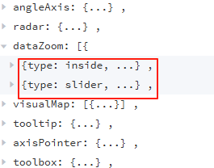
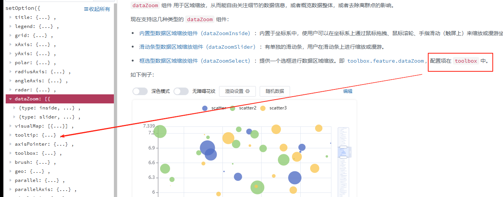

# dataZoom

## 概述

+ dataZoom 组件 用于区域缩放，从而能自由关注细节的数据信息，或者概览数据整体，或者去除离群点的影响。

+ 现在支持这几种类型的 dataZoom 组件：

  + 内置型数据区域缩放组件（dataZoomInside）：内置于坐标系中，使用户可以在坐标系上通过鼠标拖拽、鼠标滚轮、手指滑动（触屏上）来缩放或漫游坐标系

  + 滑动条型数据区域缩放组件（dataZoomSlider）：有单独的滑动条，用户在滑动条上进行缩放或漫游

    

  + 框选型数据区域缩放组件（dataZoomSelect）：提供一个选框进行数据区域缩放

    + 即 toolbox.feature.dataZoom，配置项在 toolbox 中

    

## 类型 slider
