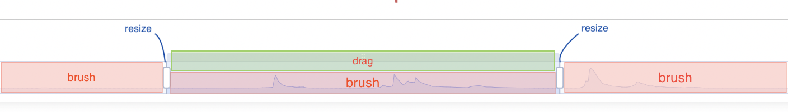

# slider 类型

## 概述

+ 滑动条型数据区域缩放组件（dataZoomInside）

+ 滑动条型数据区域缩放组件提供了数据缩略图显示，缩放，刷选，拖拽，点击快速定位等数据筛选的功能

  

## 属性

+ type
+ id
+ show
+ backgroundColor
+ dataBackground
+ selectedDataBackground
+ fillerColor
+  borderColor
+ borderRadius
+ handleIcon
+ handleSize
+ handleStyle
+  handleLabel
+ moveHandleIcon
+  moveHandleSize
+  moveHandleStyle
+  labelPrecision
+  labelFormatter
+  showDetail
+  showDataShadow
+  realtime
+ textStyle
+ xAxisIndex
+ yAxisIndex
+  radiusAxisIndex
+ angleAxisIndex
+ filterMode
+ start
+ end
+ startValue
+ endValue
+  minSpan
+ maxSpan
+ maxValueSpan
+  orient
+  zoomLock
+ throttle
+  rangeMode
+ zlevel
+ z
+ left
+ top
+ right
+ bottom
+ width
+ height
+ brushSelect
+ brushStyle
+ emphasis

