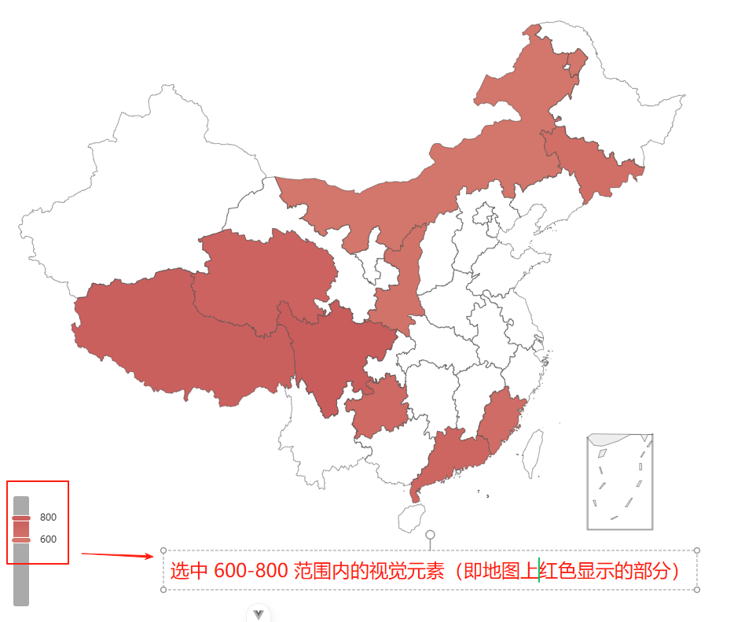
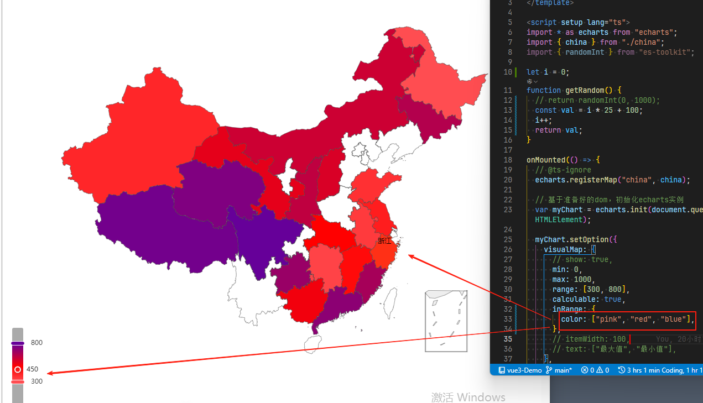
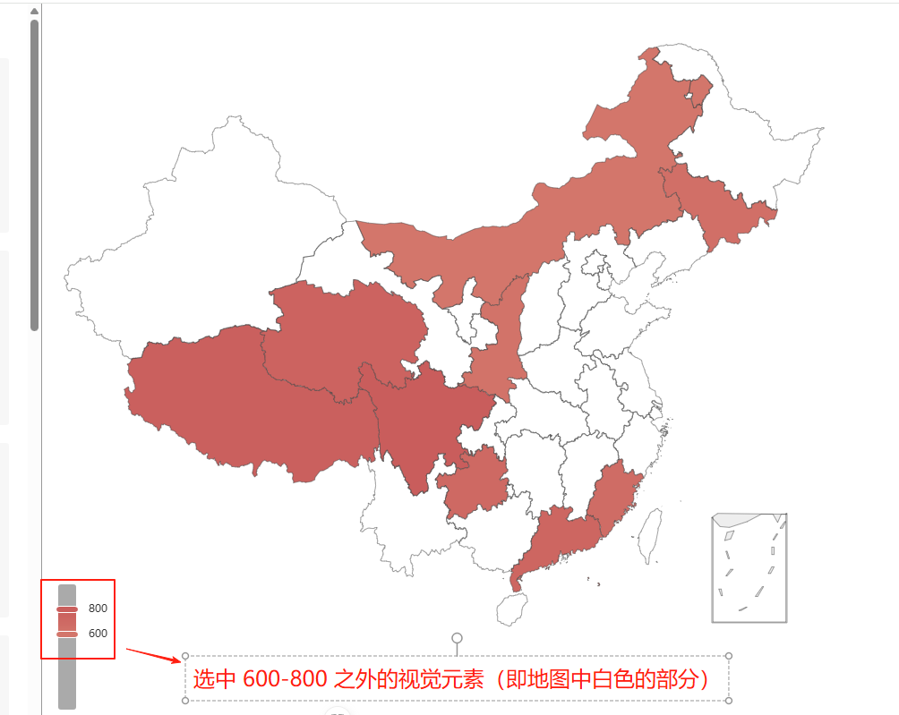
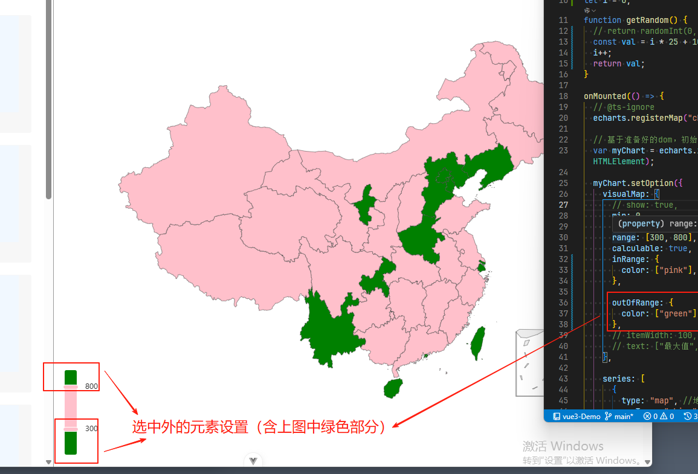
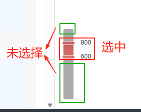

# inRange outOfRange controller

## inRange

+ `Object`

+ 定义 在选中范围中 的视觉元素

  

+ inRange 没有指定，则会默认会设置 `color: ['#f6efa6', '#d88273', '#bf444c']` ，如果你不想要这个color，可以 `inRange: {color: null}` 来去除

+ 定义方式1：同时定义

  

  ```js
  visualMap: [
    {
      ...
      inRange: {
        color: ["pink", "red", "blue"],
      },

      outOfRange: {
        color: ["green"],
      },

    }
  ]
  ```

+ 定义方式2：分别定义

  ```js
  visualMap: [
    {
      ...
      target: {
        inRange: {
          color: ["pink"],
          // symbolSize: [60, 200]
        },
        outOfRange: {
          color: ["green"],
        },
      },

      // 修改控制权的样式
      controller: {
        inRange: {
          symbolSize: [30, 100]
        }
      }
    }
  ]
  ```

+ 方式3：先定义目标系列 的视觉样式 和 visualMap-continuous 共有的视觉样式，然后在单独定义 控制器的样式。这样就会后面的就会覆盖前面的

  ```js
  visualMap: [
    {
        ...,
      // 表示 目标系列 的视觉样式 和 visualMap-continuous 共有的视觉样式
      inRange: {
        color: ['#121122', 'rgba(3,4,5,0.4)', 'red'],
        symbolSize: [60, 200]
      },
      // 表示 visualMap-continuous 本身的视觉样式，会覆盖共有的视觉样式
      // 比如，symbolSize 覆盖成为 [30, 100]，而 color 不变
      controller: {
        inRange: {
          symbolSize: [30, 100]
        }
      }
    }
  ]
  ```

## outOfRange

+ 定义 在选中范围外 的视觉元素

  
  

+ 用户可以和 visualMap 组件交互，用鼠标或触摸选择范围

## controller

+ 设置控制器的样式

  

  ```js
  visualMap: [
    {
      ...
      // target: {
      //   inRange: {
      //     color: ["pink"],
      //     // symbolSize: [60, 200]
      //   },
      //   outOfRange: {
      //     color: ["green"],
      //   },
      // },

      // 修改控制权的样式
      controller: {
        inRange: {
          symbolSize: [30, 100]
        }
      }

    }
  ]
  ```
