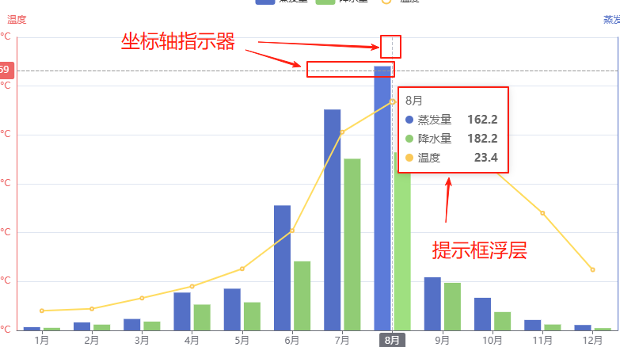

# tooltip 提示框

## 概述

+ 提示框组件

  

+ 组成部分

  + 坐标轴指示器
  + 提示层 （内部是一个div标签）

  

## 设置位置

+ 提示框组件可以设置在多种地方：

+ 可以设置在全局，即 `tooltip` 建议

  ```js
  myChart.setOption({
    // 开启提示框
    tooltip: {},
  });
  ```

+ 可以设置在坐标系中，即 `grid.tooltip` 、 `polar.tooltip` 、 `single.tooltip`
+ 可以设置在系列中，即 `series.tooltip`
+ 可以设置在系列的每个数据项中，即 `series.data.tooltip`

## 属性

+ show `boolean`

  + 是否显示提示框组件
  + 包括提示框浮层和 axisPointer
  + 默认 `true`

+ trigger

  + 触发类型 默认 `'item'`

  + 可选：

    + 'item' 数据项图形触发，主要在散点图，饼图等无类目轴的图表中使用

    + 'axis' 坐标轴触发，主要在柱状图，折线图等会使用类目轴的图表中使用

      + 在 ECharts 2.x 中只支持类目轴上使用 axis trigger，在 ECharts 3 中支持在直角坐标系和极坐标系上的所有类型的轴
      + 并且可以通过 `axisPointer.axis` 指定坐标轴

    + 'none' 什么都不触发

+ axisPointer 详见下面
+ showContent `boolean`

  + 是否显示提示框浮层，默认 `true`
  + 只需tooltip触发事件或显示axisPointer而不需要显示内容时可配置该项为 `false`
    


+ alwaysShowContent `boolean`

  + 是否永远显示提示框内容 默认 `false`
  + 默认情况下在移出可触发提示框区域后 一定时间 后隐藏，设置为 `true` 可以保证一直显示提示框内容

  + 该属性为 ECharts 3.0 中新加

+ triggerOn `string`

  + 提示框触发的条件 默认 `mousemove|click`

  + 可选：

    + 'mousemove' 鼠标移动时触发
    + 'click' 鼠标点击时触发
    + 'mousemove|click' 同时鼠标移动和点击时触发
    + 'none' 不在 'mousemove' 或 'click' 时触发，用户可以通过 `action.tooltip.showTip` 和 `action.tooltip.hideTip` 来手动触发和隐藏。也可以通过 axisPointer.handle 来触发或隐藏

+ showDelay `number`

  + 浮层显示的延迟，单位为 ms，默认没有延迟 `0` ，也不建议设置
  + 在 `triggerOn` 为 `'mousemove'` 时有效

+ hideDelay `number`

  + 浮层隐藏的延迟，单位为 ms  默认值 `100`
  + 在 `alwaysShowContent` 为 `true` 的时候无效

+ enterable `boolean`

  + 鼠标是否可进入提示框浮层中，默认为 `false`
  + 如需详情内交互，如添加链接，按钮，可设置为 `true`

+ renderMode `string`

  + 浮层的渲染模式，默认以 `'html'` 即额外的 DOM 节点展示 tooltip；
  + 此外还可以设置为 'richText' 表示以富文本的形式渲染，渲染的结果在图表对应的 Canvas 中，这对于一些没有 DOM 的环境（如微信小程序）有更好的支持

+ confine `boolean`

  + 是否将 tooltip 框限制在图表的区域内 默认值 `false`

  + 当图表外层的 dom 被设置为 'overflow: hidden'，或者移动端窄屏，导致 tooltip 超出外界被截断时，此配置比较有用

+ appendToBody

  + 已废弃，请使用 appendTo

+ appendTo `string | HTMLElement | Function`

  + 将 tooltip 的 DOM 节点添加到哪个节点下。只有当 renderMode 为 'html' 是有意义的

+ className

  + 指定 tooltip 的 DOM 节点的 CSS 类（只在 html 模式下生效）

  ```css
  className: 'echarts-tooltip echarts-tooltip-dark'
  ```

+ transitionDuration `number`

  + 提示框浮层的移动动画过渡时间，单位是 s 默认值 `0.4`
  + 设置为 0 的时候会紧跟着鼠标移动

+ position 详见下面
+ formatter 详见下面
+ valueFormatter
+ backgroundColor
+ borderColor
+ borderWidth
+ padding
+ textStyle
+ extraCssText
+ order

## position

+ `string | Array | Function`

+ 提示框浮层的位置，默认不设置时位置会跟随鼠标的位置

+ 可选

  + 'inside' 鼠标所在图形的内部中心位置，只在 trigger 为'item'的时候有效

  + 'top' 鼠标所在图形上侧，只在 trigger 为'item'的时候有效

  + 'left' 鼠标所在图形左侧，只在 trigger 为'item'的时候有效

  + 'right' 鼠标所在图形右侧，只在 trigger 为'item'的时候有效

  + 'bottom' 鼠标所在图形底侧，只在 trigger 为'item'的时候有效

  + Array 通过数组表示提示框浮层的位置，支持数字设置绝对位置，百分比设置相对位置

    ```js
    // 绝对位置，相对于容器左侧 10px, 上侧 10 px
    position: [10, 10]

    // 相对位置，放置在容器正中间
    position: ['50%', '50%']
    ```

  + Function 回调函数

    ```js
    (point: Array, params: Object|Array.<Object>, dom: HTMLDomElement, rect: Object, size: Object) => Array
    ```

    + 参数：
      + point: 鼠标位置，如 [20, 40]
      + params: 同 formatter 的参数相同
      + dom: tooltip 的 dom 对象
      + rect: 只有鼠标在图形上时有效，是一个用x, y, width, height四个属性表达的图形包围盒
      + size: 包括 dom 的尺寸和 echarts 容器的当前尺寸，例如：{contentSize: [width, height], viewSize: [width, height]}

    + 返回值：

      + 可以是一个表示 tooltip 位置的数组，数组值可以是绝对的像素值，也可以是相 百分比
      + 也可以是一个对象，如：{left: 10, top: 30}，或者 {right: '20%', bottom: 40}

      ```js
      position: function (point, params, dom, rect, size) {
        // 固定在顶部
        return [point[0], '10%'];
      }
      ```

      ```js
      position: function (pos, params, dom, rect, size) {
        // 鼠标在左侧时 tooltip 显示到右侧，鼠标在右侧时 tooltip 显示到左侧。
        var obj = {top: 60};
        obj[['left', 'right'][+(pos[0] < size.viewSize[0] / 2)]] = 5;
        return obj;
      }
      ```

## formatter

+ 提示框浮层内容格式器，支持字符串模板和回调函数两种形式 `string | Function`

+ 字符串模板

  + 模板变量有 {a}, {b}，{c}，{d}，{e}，分别表示系列名，数据名，数据值等。 在 trigger 为 'axis' 的时候，会有多个系列的数据，此时可以通过 {a0}, {a1}, {a2} 这种后面加索引的方式表示系列的索引。 不同图表类型下的 {a}，{b}，{c}，{d} 含义不一样。 其中变量{a}, {b}, {c}, {d}在不同图表类型下代表数据含义为：

    + 折线（区域）图、柱状（条形）图、K线图 : {a}（系列名称），{b}（类目值），{c}（数值）, {d}（无）

    + 散点图（气泡）图 : {a}（系列名称），{b}（数据名称），{c}（数值数组）, {d}（无）

    + 地图 : {a}（系列名称），{b}（区域名称），{c}（合并数值）, {d}（无）

    + 饼图、仪表盘、漏斗图: {a}（系列名称），{b}（数据项名称），{c}（数值）, {d}（百分比）

    ```js
    // 例如
    formatter: '{b0}: {c0}<br />{b1}: {c1}'
    ```

+ 回调函数

  + 回调函数格式

    ```js
    (params: Object|Array, ticket: string, callback: (ticket: string, html: string)) => string | HTMLElement | HTMLElement[]
    ```

  + 支持返回 HTML 字符串或者创建的 DOM 实例

## axisPointer

+ 坐标轴指示器配置项 `Object`

+ tooltip.axisPointer 是配置坐标轴指示器的快捷方式

  + 实际上坐标轴指示器的全部功能，都可以通过轴上的 axisPointer 配置项完成（例如 xAxis.axisPointer 或 angleAxis.axisPointer）
  + 但是使用 tooltip.axisPointer 在简单场景下会更方便一些

  + 注意： tooltip.axisPointer 中诸配置项的优先级低于轴上的 axisPointer 的配置项
