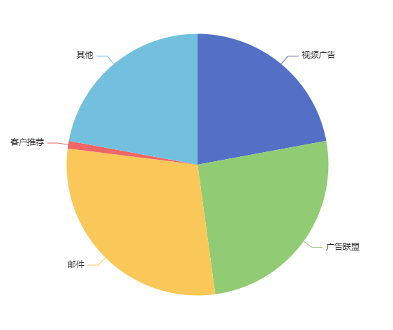
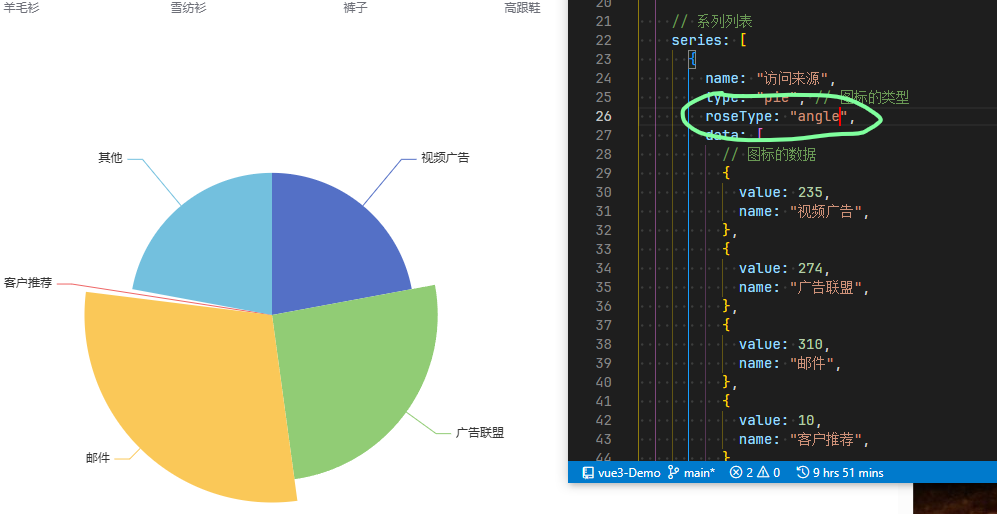

# 饼图

## 概述

+ 概述

  ```js
  // 基于准备好的dom，初始化echarts实例
  var myChart = echarts.init(document.querySelector(".pie")!);
  // 绘制图表
  myChart.setOption({
    title: {
      text: "ECharts 饼图示例",
    },
    // 图例
    // legend: {
    //   data: ["销量"],
    // },

    // 系列列表
    series: [
      {
        name: "访问来源",
        type: "pie", // 图标的类型
        data: [
          // 图标的数据
          {
            value: 235,
            name: "视频广告",
          },
          {
            value: 274,
            name: "广告联盟",
          },
          {
            value: 310,
            name: "邮件",
          },
          {
            value: 10,
            name: "客户推荐",
          },
          {
            value: 235,
            name: "其他",
          },
        ],
      },
    ],
  });
  ```

## 南丁格尔图

+ roseType

  
  
