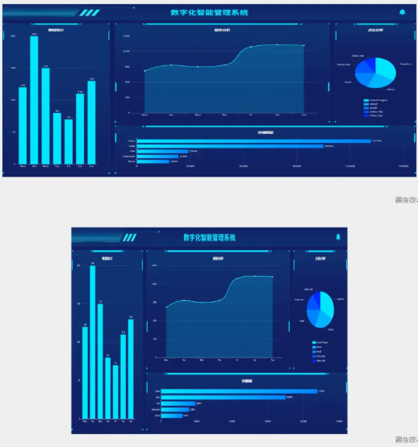
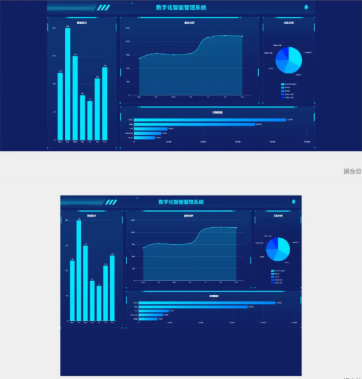
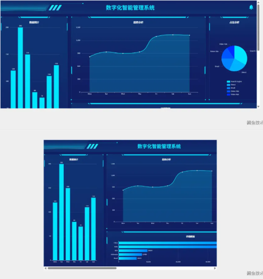
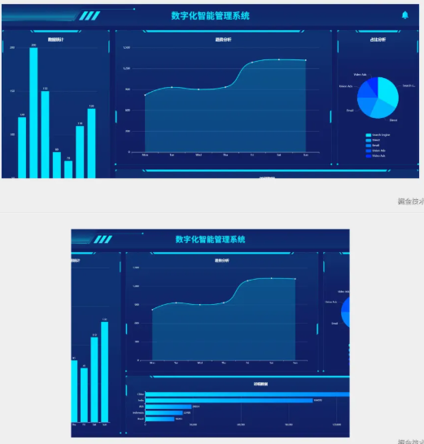

# 基础

## 大屏适配的困境

+ 在大屏项目中，适配问题几乎是每个开发者都会遇到的挑战
+ 屏幕尺寸的多样性、设计稿与实际屏幕的比例差异，都使得适配变得复杂

## 四种适配模式

+ 拉伸填充（fill）
+ 保持比例（contain）
+ 滚动显示（scroll）
+ 隐藏超出（hidden）

## 为什么不能同时满足所有要求？

+ 这四种适配模式各有优缺点，但它们在逻辑上是相互矛盾的

+ 具体来说：

  + 不留白：要求内容完全填充视口，没有任何空白区域。这通常需要拉伸或缩放内容以适应视口的宽高比
  + 不变形：要求内容保持其原始宽高比，不被拉伸或压缩。这通常会导致内容无法完全填充视口，从而出现空白区域（黑边）
  + 没滚动条：要求内容完全适应视口，不能超出视口范围。这通常需要隐藏超出部分或限制内容的大小

+ 这三个要求在逻辑上是相互矛盾的：

  + 如果内容完全填充视口（不留白），则可能会变形
  + 如果内容保持原始比例（不变形），则可能会出现空白区域（留白）
  + 如果内容超出视口范围，则需要滚动条或隐藏超出部分

## 拉伸填充（fill）

+ 特点：内容会被拉伸变形，以完全填充视口框。这种方式可以确保视口内没有空白区域，但可能会导致内容变形

+ 适用场景：适用于对内容变形不敏感的场景，例如全屏背景图

  

## 保持比例（contain）

+ 特点：内容保持原始比例，不会被拉伸变形。如果内容的宽高比与视口不一致，会在视口内出现空白区域（黑边）。这种方式可以确保内容不变形，但可能会留白

+ 适用场景：适用于需要保持内容原始比例的场景，例如视频或图片展示

  

## 滚动显示（scroll）

+ 特点：内容不会被拉伸变形，当内容超出视口时会添加滚动条。这种方式可以确保内容完整显示，但用户需要滚动才能查看全部内容

+ 适用场景：适用于内容较多且需要完整显示的场景，例如长列表或长文本

  

## 隐藏超出（hidden）

+ 特点：内容不会被拉伸变形，当内容超出视口时会隐藏超出部分。这种方式可以避免滚动条的出现，但可能会隐藏部分内容

+ 适用场景：适用于内容较多但不需要完整显示的场景，例如仪表盘

  

