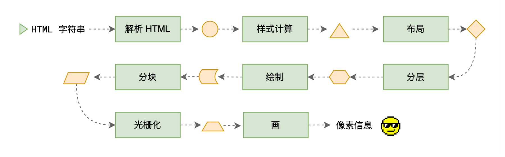
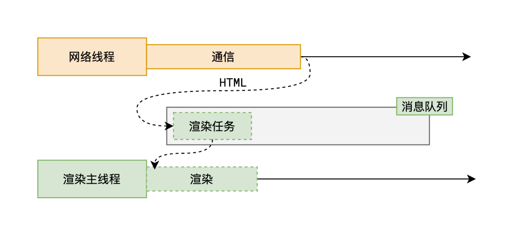
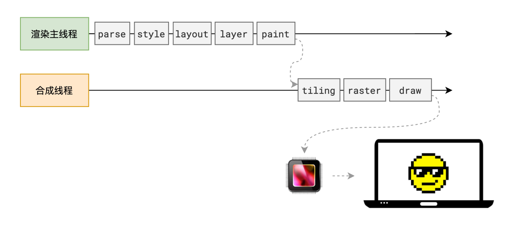

# 基础

## 渲染流程

+ 多个阶段

  + 解析 HTML
  + 样式计算
  + 布局
  + 分层
  + 生成绘制指令
  + 分块
  + 光栅化
  + 绘制

+ 每个阶段都有明确的输入输出，上一个阶段的输出会成为下一个阶段的输入

+ 这样，整个渲染流程就形成了一套组织严密的生产流水线

  

## 概述

+ 浏览器，作为用户浏览网页最基本的一个入口，我们似乎认为在地址栏输入 URL 后网页自动就出来了
+ 殊不知在用户输入网页地址，敲下回车的那一刻，浏览器背后做了诸多的事情

+ 去除 DNS 查找等这些细枝末节的工作，整个大的部分可以分为两个，那就是网络和渲染

  

+ 首先，浏览器的网络线程会发送 http 请求，和服务器之间进行通信，之后将拿到的 html 封装成一个渲染任务，并将其传递给渲染主线程的消息队列
+ 在事件循环机制的作用下，渲染主线程取出消息队列中的渲染任务，开启渲染流程

+ 浏览器从拿到 html 文档到最终渲染出页面的整体流程，如下图：

  
