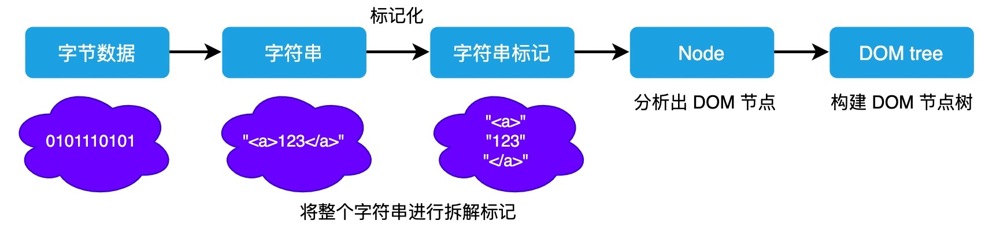
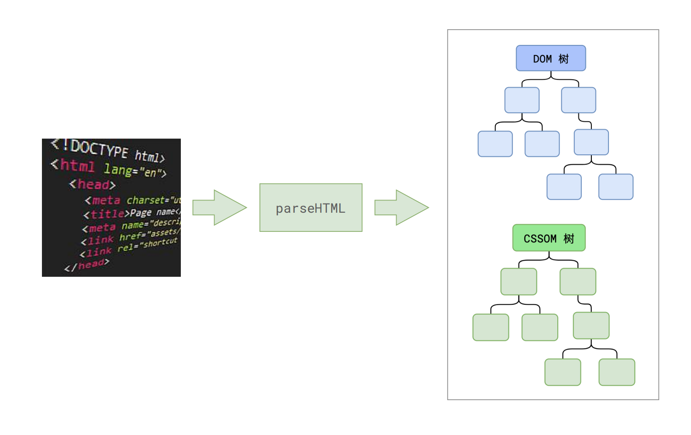
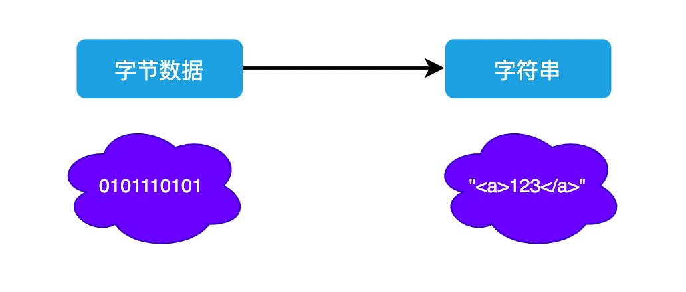
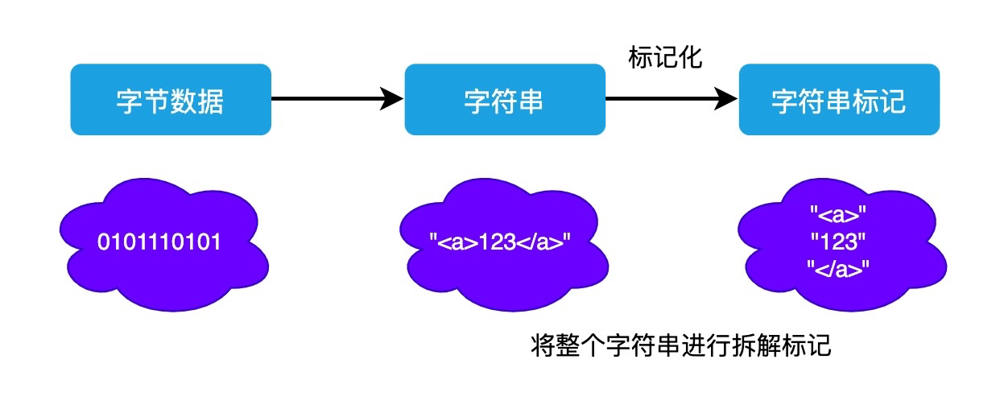
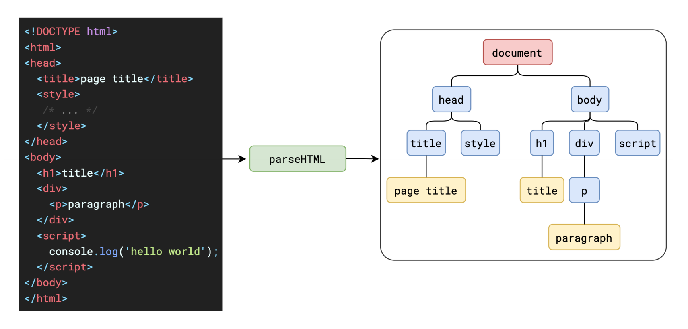
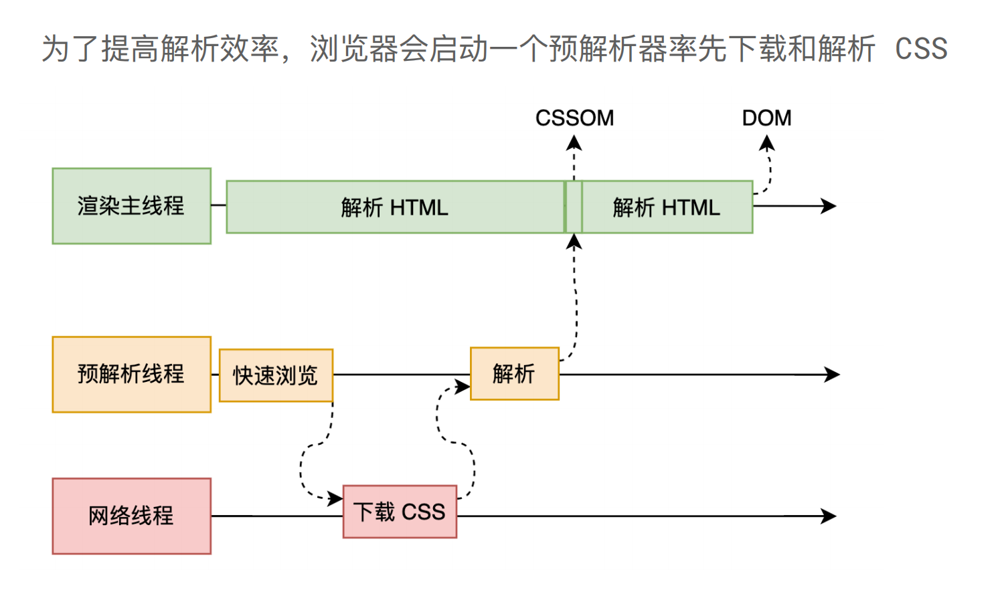
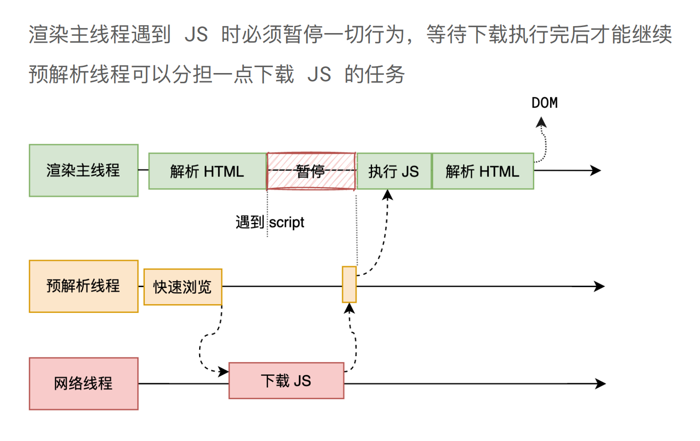

# 第一步：解析 HTML

## 整体流程

+ 首先第一步就是解析 html，生成 DOM 树

+ 整体流程

  

## 步骤1 结果

+ 第一步完成后，会得到 DOM 树和 CSSOM 树（浏览器的默认样式、内部样式、外部样式、行内样式）

  

## 解析 HTML

+ 当我们打开一个网页时，浏览器都会去请求对应的 HTML 文件
+ 虽然平时我们写代码时都会分为 HTML、CSS、JS 文件，也就是字符串，但是计算机硬件是不理解这些字符串的，所以在网络中传输的内容其实都是 0 和 1 这些字节数据

+ 当浏览器接收到这些字节数据以后，它会将这些字节数据转换为字符串，也就是我们写的代码

  

+ 当数据转换为字符串以后，浏览器会先将这些字符串通过词法分析转换为标记（ token ），这一过程在词法分析中叫做标记化（ tokenization ）

+ 为什么需要标记化呢？

  + 原因很简单，现在浏览器虽然将字节数据转为了字符串，但是此时的字符串就如何一篇标题段落全部写在一行的文章一样，浏览器此时仍然是不能理解的

  ```html
  <!-- 例如 -->
  <!DOCTYPE html><html lang="en"><head><title>Document</title></head><body><p>this is a test</p></body></html>
  ```

+ 因此现在所做的标记化，本质就是要将这长长的字符串分拆成一块块，并给这些内容打上标记，便于理解这些最小单位的代码是什么意思

  

+ 将整个字符串进行了标记化之后，就能够在此基础上构建出对应的 DOM 树出来

  

+ 上面的步骤，我们就称之为解析 HTML

## 解析css标签

+ 在解析 HTML 的过程中，我们可以能会遇到诸如 style、link 这些标签，这是和我们网页样式相关的内容。此时就会涉及到 CSS 的解析

+ 为了提高解析效率，浏览器在开始解析前，会启动一个预解析的线程，率先下载 HTML 中的外部 CSS 文件和外部的 JS 文件

+ 如果主线程解析到 link 位置，此时外部的 CSS 文件还没有下载解析好，主线程不会等待，继续解析后续的 HTML

  + 这是因为下载和解析 CSS 的工作是在预解析线程中进行的
  + 这就是 CSS 不会阻塞 HTML 解析的根本原因

  

+ 最终，CSS 的解析在经历了从字节数据、字符串、标记化后，最终也会形成一颗 CSSOM 树

  

## 解析 js 文件

+ 预解析线程除了下载外部 CSS 文件以外，还会下载外部 JS 文件
+ 如果主线程解析到 script 位置，会停止解析 HTML 转而等待 JS 文件下载好，并将全局代码解析执行完成后，才能继续解析 HTML

  + 因为 JS 代码的执行过程可能会修改当前的 DOM 树，所以 DOM 树的生成必须暂停
  + 这就是 JS 会阻塞 HTML 解析的根本原因

  

## 总结

+ 因此，如果你想首屏渲染的越快，就越不应该在最前面就加载 JS 文件，这也是都建议将 script 标签放在 body 标签底部的原因

  ```html
  <html>
    <head>
      ...
    </head>
    <body>
      <p></p>
      <script src="..."></script>
    </body>
  </html>
  ```

## 解决办法

+ 另外，在现代浏览器中，为我们提供了新的方式来避免 JS 代码阻塞渲染的情况：

  + async
  + defer
  + prefetch
  + preload
