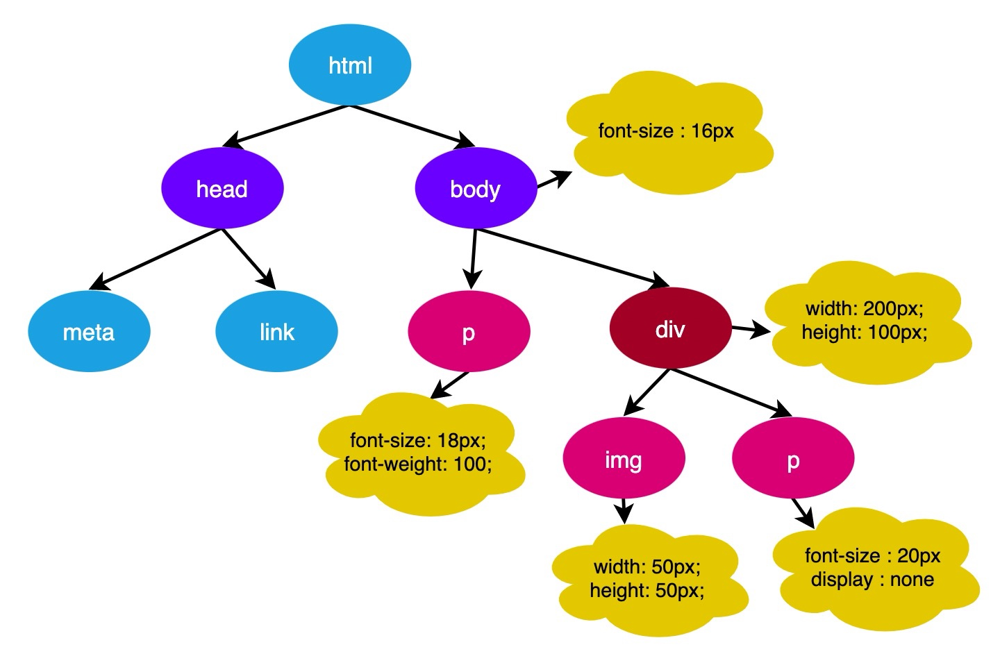

# 第二部：样式结算

## 概述

+ 拥有了 DOM 树我们还不足以知道页面的外貌，因为我们通常会为页面的元素设置一些样式。主线程会遍历得到的 DOM 树，依次为树中的每个节点计算出它最终的样式，称之为 Computed Style

+ 在这一过程中，很多预设值会变成绝对值，比如 red 会变成 rgb(255,0,0)；相对单位会变成绝对单位，比如 em 会变成 px

  

+ 浏览器会确定每一个节点的样式到底是什么，并最终生成一颗样式规则树，这棵树上面记录了每一个 DOM 节点的样式。

+ 另外需要注意的是，这里所指的浏览器确定每一个节点的样式，是指在样式计算时会对所有的 DOM 节点计算出所有的样式属性值。如果开发者在书写样式时，没有写某一项样式，那么大概率会使用其默认值。例如

  

+ 这一步完成后，我们就得到一棵带有样式的 DOM 树。也就是说，经过样式计算后，之前的 DOM 数和 CSSOM 数合并成了一颗带有样式的 DOM 树

  
