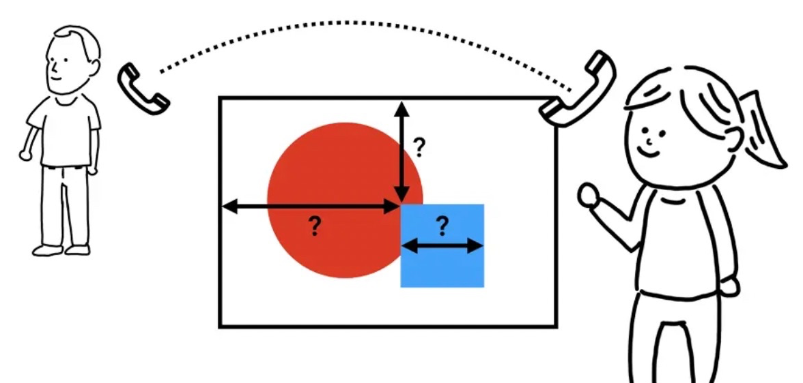
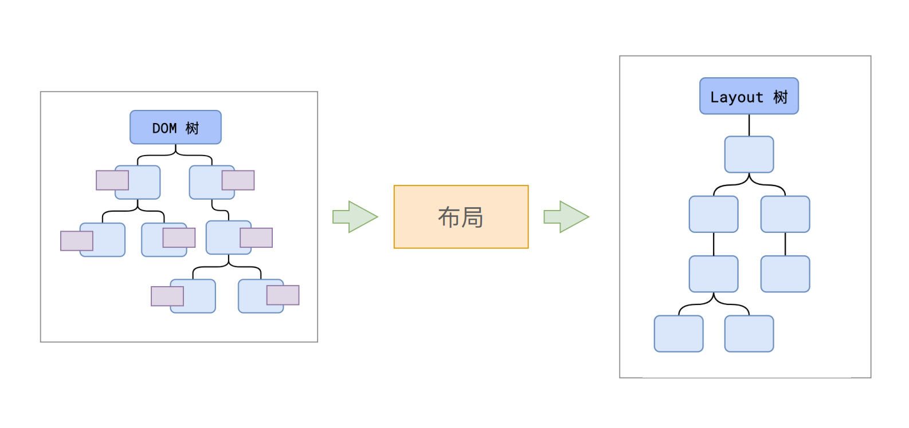
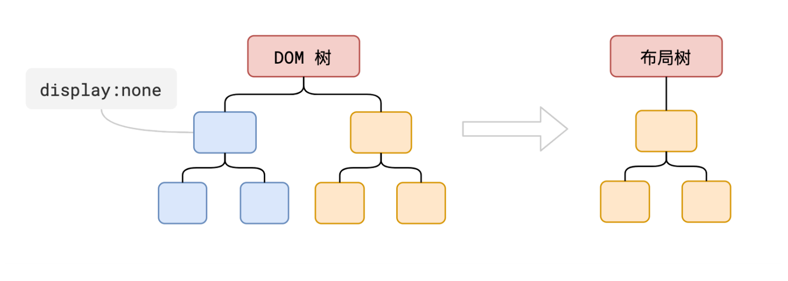
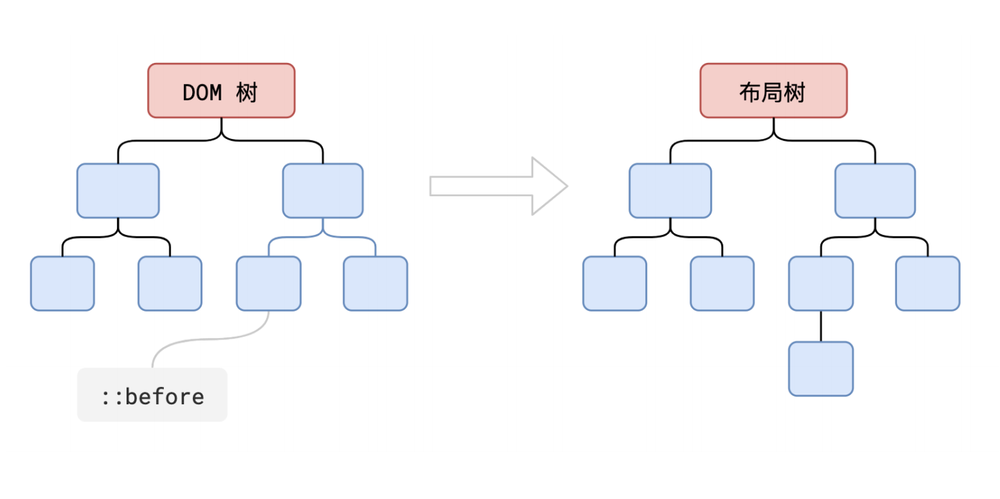
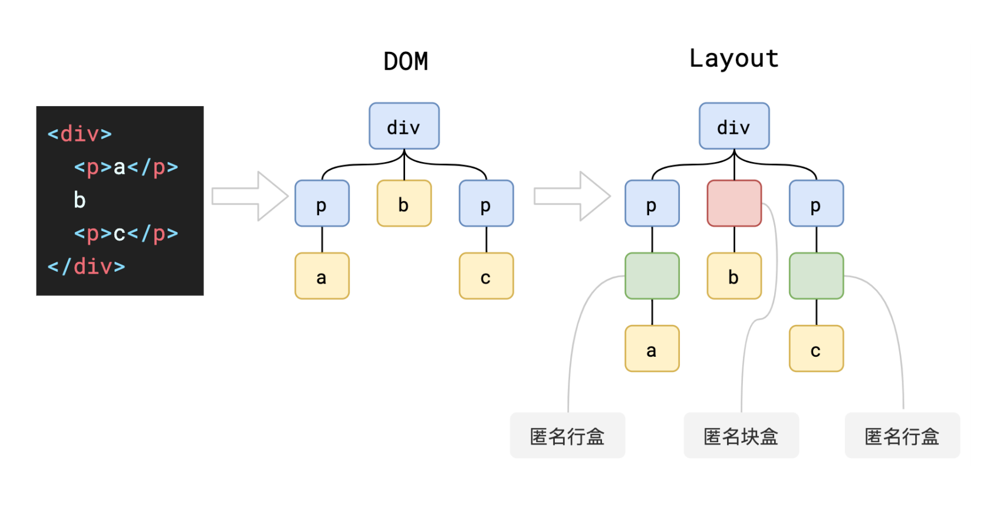

# 步骤3 布局

## 概述

+ 前面这些步骤完成之后，渲染进程就已经知道页面的具体文档结构以及每个节点拥有的样式信息了，可是这些信息还是不能最终确定页面的样子。

+ 举个例子，假如你现在想通过电话告诉你的朋友你身边的一幅画的内容：“画布上有一个红色的大圆圈和一个蓝色的正方形”，单凭这些信息你的朋友是很难知道这幅画具体是什么样子的，因为他不知道大圆圈和正方形具体在页面的什么位置，是正方形在圆圈前面呢还是圆圈在正方形的前面

  

+ 渲染网页也是同样的道理，只知道网站的文档流以及每个节点的样式是远远不足以渲染出页面内容的，还需要通过布局（layout）来计算出每个节点的几何信息（geometry）。

+ 生成布局树的具体过程是：主线程会遍历刚刚构建的 DOM 树，根据 DOM 节点的计算样式计算出一个布局树（layout tree）。布局树上每个节点会有它在页面上的 x，y 坐标以及盒子大小（bounding box sizes）的具体信息

  

+ 布局树大部分时候，和 DOM 树并非一一对应。虽然它长得和先前构建的 DOM 树差不多，但是不同的是这颗树只有那些可见的（visible）节点信息。

  + 比如 display:none 的节点没有几何信息，因此不会生成到布局树；

  

+ 又比如使用了伪元素选择器，虽然 DOM 树中不存在这些伪元素节点，但它们拥有几何信息，所以会生成到布局树中

  

+ 还有匿名行盒、匿名块盒等等都会导致 DOM 树和布局树无法一一对应

  
