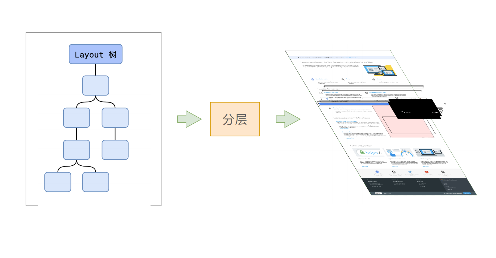
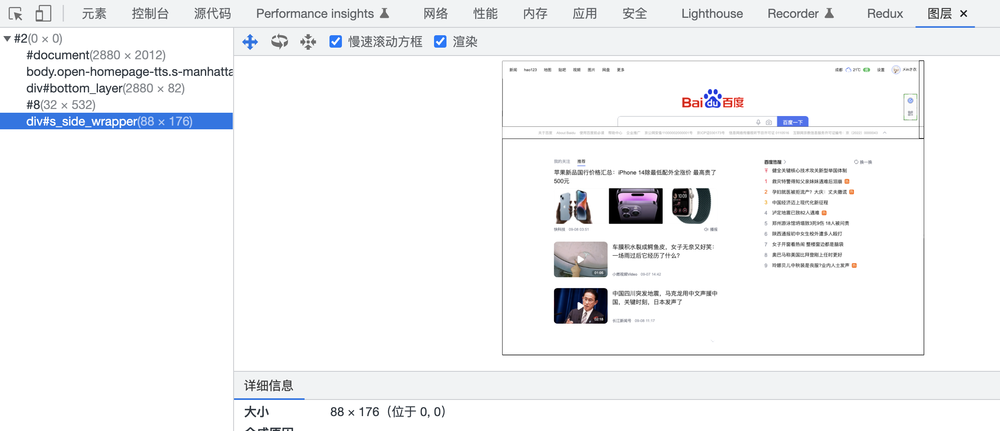

# 步骤4 分层

## 概述

+ 分层的好处在于，将来某一个层改变后，仅会对该层进行后续处理，从而提升效率

  

+ 为了确定哪些元素需要放置在哪一层，主线程需要遍历整颗布局树来创建一棵层次树（Layer Tree）

  

+ 滚动条、堆叠上下文、transform、opacity 等样式都会或多或少的影响分层结果，也可以通过使用 `will-change` 属性来告诉浏览器对其分层
