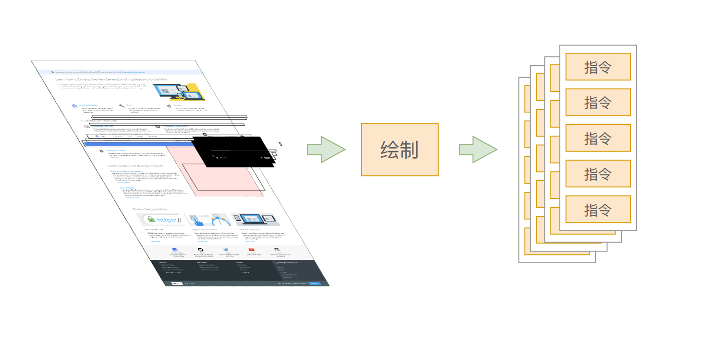
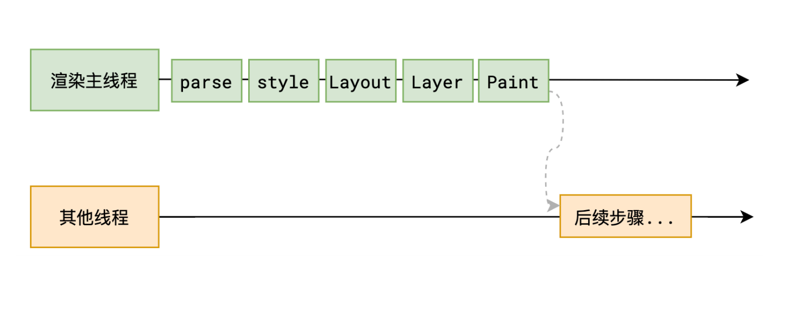

# 步骤5 生成绘制指令

## 概述

+ 主线程会为每个层单独产生绘制指令集，用于描述这一层的内容该如何画出来

  

+ 这里的绘制指令，类似于“将画笔移动到 xx 位置，放下画笔，绘制一条 xx 像素长度的线”，我们在浏览器所看到的各种复杂的页面，实际上都是这样一条指令一条指令的执行所绘制出来的

+ 如果你熟悉 Canvas，那么这样的指令类似于：

  ```js
  context.beginPath(); // 开始路径
  context.moveTo(10, 10); // 移动画笔
  context.lineTo(100, 100); // 绘画出一条直线
  context.closePath(); // 闭合路径
  context.stroke(); // 进行勾勒
  ```

+ 但是你要注意，这一步只是生成诸如上面代码的这种绘制指令集，还没有开始执行这些指令

+ 另外，还有一个重要的点你需要知道，生成绘制指令集后，渲染主线程的工程就暂时告一段落，接下来主线程将每个图层的绘制信息提交给合成线程，剩余工作将由合成线程完成

  
