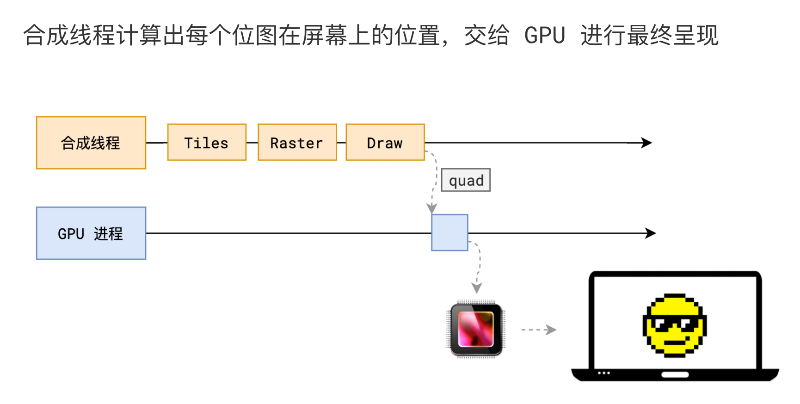
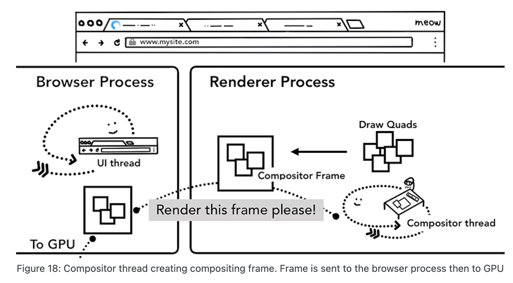

# 步骤8 绘制

## 概述

+ 当所有的图块都被栅格化后，合成线程会拿到每个层、每个块的位图，从而生成一个个「指引（quad）」信息

  

+ 指引会标识出每个位图应该画到屏幕的哪个位置，以及会考虑到旋转、缩放等变形。

+ 变形发生在合成线程，与渲染主线程无关，这就是 transform 效率高的本质原因。

+ 合成线程会通过 IPC 向浏览器进程（browser process）提交（commit）一个渲染帧。这个时候可能有另外一个合成帧被浏览器进程的 UI线程（UI thread）提交以改变浏览器的 UI。这些合成帧都会被发送给 GPU 完成最终的屏幕成像。

+ 如果合成线程收到页面滚动的事件，合成线程会构建另外一个合成帧发送给 GPU 来更新页面

  
