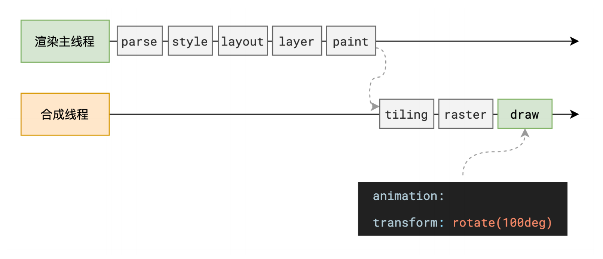

# 为什么 transform 的效率高

## 概述

+ 因为 transform 既不会影响布局也不会影响绘制指令，它影响的只是渲染流程的最后一个 `draw` 阶段

+ 由于 draw 阶段在合成线程中，所以 transform 的变化几乎不会影响渲染主线程
+ 反之，渲染主线程无论如何忙碌，也不会影响 transform 的变化

  

  <video controls src="images/transform的效率.mp4" title="Title"></video>

+ 示例

  ```html
  <style>
    .box1 > div:first-child {
      top: 0;
      animation: move1 1s alternate infinite ease-in-out;
      will-change: transform;
    }

    .box1 > div:last-child {
      top: 110px;
      animation: move2 1s alternate infinite ease-in-out;
      will-change: left;
    }

    @keyframes move1 {
      0% {
        transform: translate(0, 0);
      }
      100% {
        transform: translate(400px, 0);
      }
    }

    @keyframes move2 {
      0% {
        left: 0;
      }
      100% {
        left: 400px;
      }
    }
  </style>

  <el-button @click="onClick" type="primary">死循环</el-button>

  <script>
    const delay = () => {
      const duration = 5000;
      const start = Date.now();
      while (Date.now() - start < duration) {}
    };

    const onClick = () => {
      delay();
    };
  </script>
  ```
