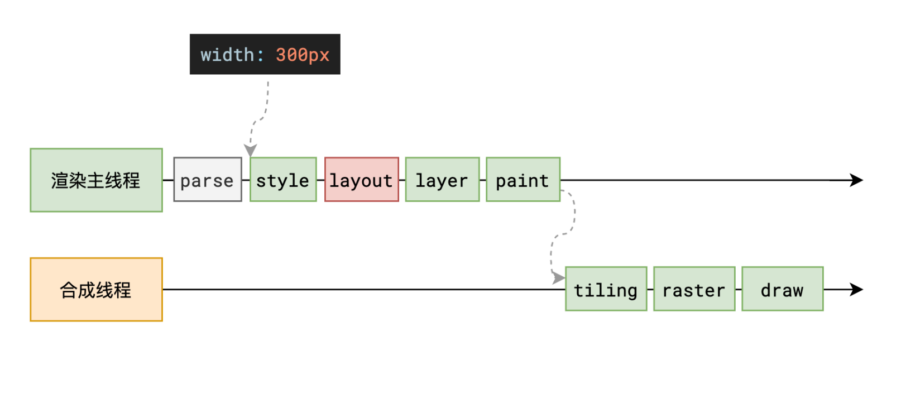
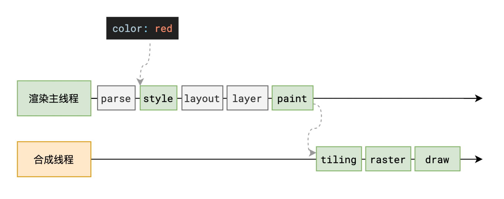

# 重排与重绘

## reflow 重排 回流

+ reflow 的本质就是重新计算 布局（layout） 树

  

+ 当进行了会影响布局树的操作后，需要重新计算布局树，会引发 layout

+ 为了避免连续的多次操作导致布局树反复计算，浏览器会合并这些操作，当 JS 代码全部完成后再进行统一计算

  + 所以，改动属性造成的 reflow 是异步完成的

+ 也同样因为如此，当 JS 获取布局属性时，就可能造成无法获取到最新的布局信息

  + 浏览器在反复权衡下，最终决定获取属性立即 reflow

    ```js
    // 设置 100px 和 150px 的操作会被合并
    el.style.marginLeft = '100px';
    el.style.marginLeft = '150px';

    // 因为要获取最新的属性，所以立即触发回流
    console.log(el.style.marginLeft); // 150px

    el.style.marginLeft = '200px';
    ```

## repaint 重绘

+ repaint 的本质就是重新根据分层信息计算了绘制指令

+ 当改动了可见样式后，就需要重新计算，会引发 repaint

+ 由于元素的布局信息也属于可见样式，所以 reflow 一定会引起 repaint

  

