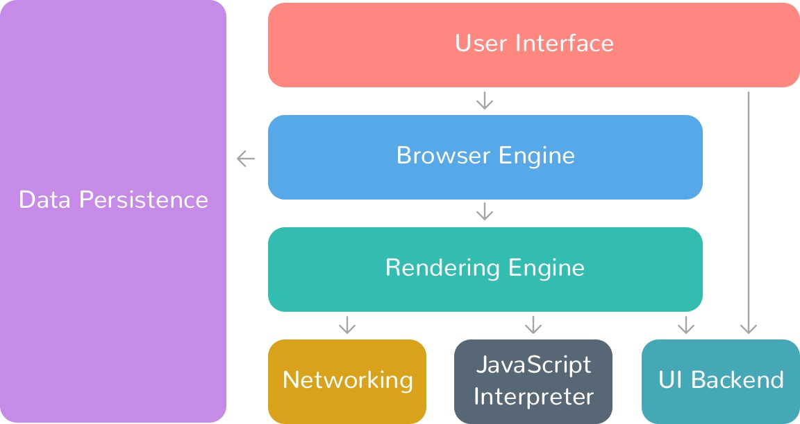

# 浏览器架构

## 概述

+ 一个 Web 浏览器中，主要组件有：

  + 用户界面（user interface）

  + 浏览器引擎（browser engine）

  + 渲染引擎（rendering engine）

  + 网络（networking）

  + JS 解释器（JavaScript interpreter）

  + 用户界面后端（UI backend）

  + 数据存储（data storage）

  

## 用户界面（user interface）

+ 用户界面用于呈现浏览器窗口部件，比如地址栏、前进后退按钮、书签、顶部菜单等

## 浏览器引擎（browser engine）

+ 它是 UI 和渲染引擎之间的桥梁
+ 接收来自 UI 的输入，然后通过操纵渲染引擎将网页或者其他资源显示在浏览器中

## 渲染引擎（rendering engine）

+ 负责在浏览器窗口上显示请求的内容
+ 例如，用户请求一个 HTML 页面，则它负责解析 HTML 文档和 CSS，并将解析和格式化的内容显示在屏幕上
+ 我们平时说的浏览器内核就是指这部分

+ 现代网络浏览器的渲染引擎：

  + Firefox：Gecko Software

  + Safari：WebKit

  + Chrome、Opera (15 版本之后)：Blink

  + Internet Explorer：Trident

## 网络（networking）

+ 该模块处理浏览器内的各种网络通信
+ 它使用一组通信协议，如 HTTP、HTTPs、FTP，同时通过 URL 获取请求的资源

## JS 解释器（JavaScript interpreter）

+ JavaScript 是一种脚本语言，允许我们动态更新 Web 内容、控制由浏览器的 JS 引擎执行的多媒体和动画图像。

+ DOM 和 CSSOM 为 JS 提供了一个接口，可以改变 DOM 和 CSSOM。由于浏览器不确定特定的 JS 会做什么，它会在遇到 script 标签后立即暂停 DOM 树的构建。

+ 每个脚本都是一个解析拦截器，会让 DOM 树的构建停止。

+ JS 引擎在从服务器获取并输入 JS 解析器后立即开始解析代码。它将它们转换为机器理解的代表性对象。在抽象句法结构的树表示中存储所有解析器信息的对象称为对象语法树（AST）。这些对象被送入一个解释器，该解释器将这些对象翻译成字节码。

+ 这些是即时 (JIT) 编译器，这意味着从服务器下载的 JavaScript 文件在客户端的计算机上实时编译。解释器和编译器是结合在一起的。解释器几乎立即执行源代码；编译器生成客户端系统直接执行的机器代码。

+ 不同的浏览器使用不同的 JS 引擎：

  + Chrome： V8 (JavaScript 引擎) (Node JS 建立在此之上)

  + Mozilla： SpiderMonkey (旧称“松鼠鱼”)

  + Microsoft Edge：Chakra

  + Safari：JavaScriptCore / Nitro WebKit

## 用户界面后端（UI backend）

+ 用于绘制基本的窗口小部件，比如下拉列表、文本框、按钮等，向上提供公开的接口，向下调用操作系统的用户界面

## 数据存储（data storage）

+ 这是一个持久层。浏览器可能需要在本地保存各种数据，例如 cookie
+ 浏览器还支持 localStorage、IndexedDB、WebSQL 和 FileSystem 等存储机制
