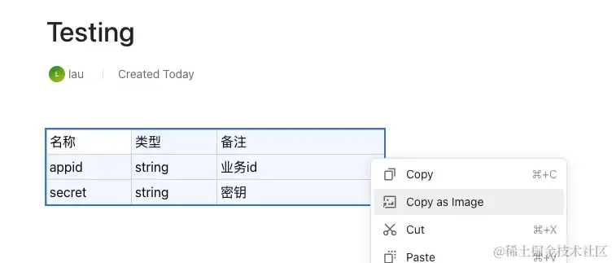

# 基础

## 一键复制网页内容为图片原理

+ 一键复制网页内容为图片

  

## 功能拆解

+ 要实现这个功能, 要拆分为4个步骤:

  1. 获得选中内容所属的 div

  2. 把选中内容的div 转换成canvas

  3. 转换canvas到二进制图像

  4. 复制二进制图像到剪贴板


## 步骤2 把选中内容的div 转换成canvas

+ 库 `html2canvas`

  ```js
  html2canvas(document.body).then(function(canvas) {
    document.body.appendChild(canvas);
  });
  ```

  ```js
  function copyDivToImage() {
    const element = document.getElementById('target');
    html2canvas(element).then(canvas => {
      // canvas 拿到了, 然后呢
    }
  }
  ```

## 步骤3 转换canvas到二进制图像

+ HTMLCanvasElement: toBlob()

  ```js
  function copyDivToImage() {
    const element = document.getElementById('target');
    html2canvas(element).then(canvas => {
      canvas.toBlob(
        (blob) => {
          // 复制文件到剪贴板
        },
        'image/png', // 文件的格式
        1 // 图像压缩质量 0-1
      );
    });
  }
  ```

## 步骤4 复制二进制图像到剪贴板

+  ClipboardItem - Web APIs | MDN (mozilla.org) 可以直接调用浏览器的 navigator api

  ```js
  function copyDivToImage() {
    const element = document.getElementById('target');
    html2canvas(element).then(canvas => {
      canvas.toBlob(
        (blob) => {
          // 复制文件到剪贴板
          try {
            await navigator.clipboard.write([
              // eslint-disable-next-line no-undef
              new ClipboardItem({
                [blob.type]: blob
              })
            ]);
            console.log('图像已成功复制到剪��板');
          } catch (err) {
            console.error('无法复制图像到剪贴板', err);
          }
        },
        'image/png', // 文件的格式
        1 // 图像压缩质量 0-1
      );
    });
  }
  ```

## 注意点

+ 浏览器剪贴板对 jpeg的支持不大好, 需要把 `canvas.toBlob()` 的参数改成了 `'image/png'`.

