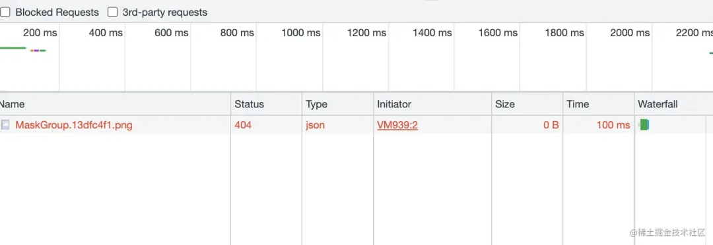
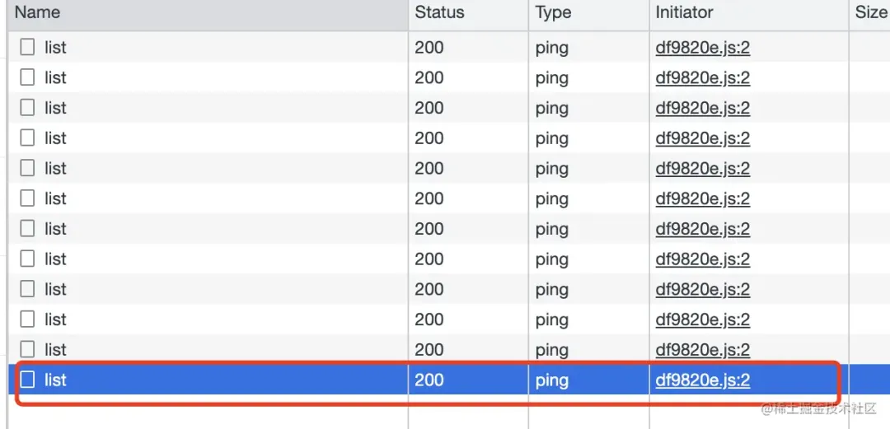

# 埋点上报

## 概述

+ 所谓'埋点'是数据采集领域（尤其是用户行为数据采集领域）的术语，指的是针对特定用户行为或事件进行捕获、处理和发送的相关技术及其实施过程
+ 比如用户某个icon点击次数、观看某个视频的时长等等

## 埋点上报方式

+ ajax
+ img
+ navigator.sendBeacon *推荐*

## 方式1：基于ajax的埋点上报

+ 因为埋点实际上是对关键节点的数据进行上报是和服务端交互的一个过程，所以我们可以和后端约定一个接口通过ajax去进行数据上报

+ 代码实现

  ```js
  function buryingPointAjax(data) {
    return new Promise((resolve, reject) => {
      // 创建ajax请求
      const xhr = new XMLHttpRequest();
      // 定义请求接口
      xhr.open("post", '/buryingPoint', true);
      // 发送数据
      xhr.send(data);
    });
  }
  ```

+ 使用时，直接调用即可

  ```js
  let info = {}

  buryingPointAjax(info) // 这样就成功上报了info的对象
  ```

+ 缺点

  + 一般而言，埋点域名并不是当前域名，因此请求会存在跨域风险，且如果ajax配置不正确可能会浏览器拦截。因此使用ajax这类请求并不是万全之策

+ 封装上报方法

  ```js
  // ajax 上报
  export function sendAjax({ req = '', params }: reportParams) {
    return new Promise<boolean>((resolve, reject) => {
      if (req) {
        postAction(req, params)
          .then(() => resolve(true))
          .catch(() => reject(false));
      } else {
        reject(false);
      }
    });
  }
  ```

## 方式2：基于img的埋点上报

+ 如果使用ajax的话，会存在跨域的问题
+ 而且数据上报前端主要是负责将数据传递到后端，并不过分强调前后端交互
+ 因此我们可以通过一些支持跨域的标签去实现数据上报功能

+ 使用img标签去做埋点上报，img标签加载并不需要挂载到页面上，基于js去 `new image()` ，设置其src之后就可以直接请求图片

  ```js
  var img=new Image();
  img.src="https://lf3-cdn-tos.bytescm.com/obj/static/xitu_juejin_web/img/MaskGroup.13dfc4f1.png";
  ```

+ 可以看到即便未被挂载到页面上依旧发起了请求

  

+ 结论

  + img兼容性好
  + 无需挂载到页面上，反复操作dom
  + img的加载不会阻塞html的解析，但img加载后并不渲染，它需要等待Render Tree生成完后才和Render Tree一起渲染出来

+ 注：通常埋点上报会使用gif图，合法的 GIF 只需要 43 个字节

+ 封装上报方法

  ```js
  // img 上报
  export function sendImg({ img = '', params }: reportParams) {
    return new Promise<boolean>((resolve, reject) => {
      const imageData  = objectToQueryString(params)
      const img_o = new Image();
      img_o.onload = () => resolve(true);
      img_o.onerror = () => reject(false);
      img_o.src = `${img}?${imageData}`;
    })
  }
  ```

## 方式3：基于Navigator.sendBeacon的埋点上报

+ Navigator.sendBeacon是目前通用的埋点上报方案
+ Navigator.sendBeacon方法接受两个参数

  + 第一个参数是目标服务器的 URL
  + 第二个参数是所要发送的数据（可选），可以是任意类型（字符串、表单对象、二进制对象等等）

+ `navigator.sendBeacon()`  方法可用于通过 HTTP POST 将少量数据 异步 传输到 Web 服务器

+ 作用：它主要用于将统计数据发送到 Web 服务器，同时避免了用传统技术（如：XMLHttpRequest）发送分析数据的一些问题

+ 补充

  + sendBeacon 如果成功进入浏览器的发送队列后，会返回true；如果受到队列总数、数据大小的限制后，会返回false
  + 返回ture后，只是表示进入了发送队列，浏览器会尽力保证发送成功，但是否成功了，不会再有任何返回值

+ 示例

  
  

+ 优势

  + 相较于img标签，使用navigator.sendBeacon会更规范，数据传输上可传输资源类型会更多
  + 对于ajax在页面卸载时上报，ajax有可能没上报完，页面就卸载了导致请求中断，因此ajax处理这种情况时必须作为同步操作
  + sendBeacon是异步的，不会影响当前页到下一个页面的跳转速度，且不受同域限制。这个方法还是异步发出请求，但是请求与当前页面脱离关联，作为浏览器的任务，因此可以保证会把数据发出去，不拖延卸载流程

+ 封装上报方法

  ```js
  // sendBeacon 上报
  export async function sendBeacon( {url = '', params }: reportParams) {
    if (navigator?.sendBeacon && url) {
      const isSuccess = await navigator?.sendBeacon(url, JSON.stringify(params));
      if (isSuccess) return true;
    }
    return false;
  }
  ```
