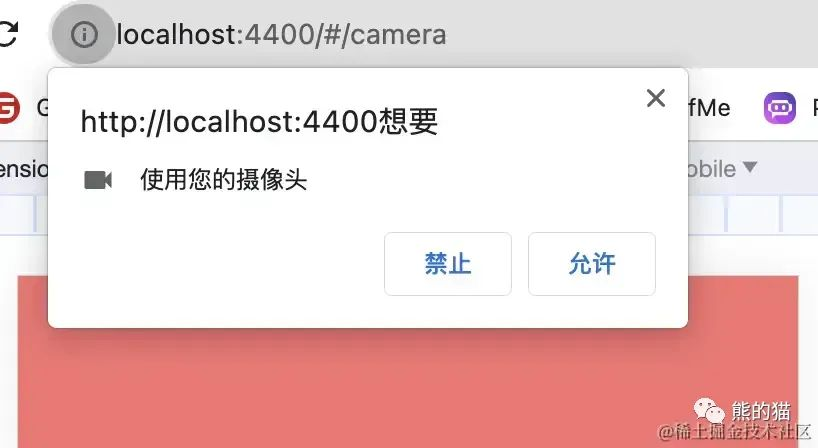

# 调取摄像头

## 1. window.navigator

+ 你想调取手机的摄像头，首先你得先检验当前设备是否有摄像设备，`window` 身上自带了一个 `navigator` 属性，这个对象有一个叫做 `mediaDevices` 的属性是我们即将用到的

+ `mediaDevices` 方法身上只有一个值为 `null` 的 `ondevicechange` 属性

  

+ 需要使用原型上的方法: `enumerateDevices` 与 `getUserMedia`

  

## 1.1 判断是否存在视频设备 enumerateDevices

+ `enumerateDevices` 方法来查看当前设备是否存在（它的返回值是一个 `promise` 类型，我们直接用 `async` 和 `await` ）

  ```js
  const checkCamera = async () => {
    const navigator = window.navigator.mediaDevices;
    const devices = await navigator.enumerateDevices();

    console.log("devices", devices);
  };
  ```

  // 可以查看是音频设备还是视频设备
  

## 1.2 获取摄像头 getUserMedia

+ `navigator.getUserMedia` 这个函数接收一个对象作为参数，这个对象可以预设一些值，来作为我们请求摄像头的一些参数

+ 这里我们的重点是 `facingMode` 这个属性，因为我们扫一扫一般都是后置摄像头

  ```js
  navigator.facingMode({
    audio: false, // 我们不需要音频设备，所以设置为false
    video: {
      width: 500,
      height: 500,
      facingMode: {
        exace: "environment", // 强制后置摄像头
      }
      // facingMode："user" // 前置摄像头
    }
  })
  ```

  

+ 当你执行了这个函数以后，你会看到浏览器有如下提示(浏览器向手机申请摄像头，在得到了确认以后，手机将摄像头的数据线递给了浏览器)

  

+ 使用 `<video />` 标签渲染结果

  ```html
  <div>
    <video ref="videoEl" />
  </div>

  <script>
    const videoEl = ref<HTMLVideoElement>();
  </script>
  ```

+ 将流数据赋值给 `video` 标签的 `srcObject` 属性

  ```js
  const videoEl = ref<HTMLVideoElement>();

  // 1. 获取摄像头数据流
  const stream = await navigator.facingMode({
    audio: false, // 我们不需要音频设备，所以设置为false
    video: {
      width: 500,
      height: 500,
      facingMode: {
        exace: "environment", // 强制后置摄像头
      }
      // facingMode："user" // 前置摄像头
    }
  });

  if(!videoEl.value) return

  // 讲数据流赋值给 video 的 srcObject 属性
  videoEl.value.srcObject = stream;

  // 3. 调取 play 方法
  videoEl.value.play();
  ```

## 截取当前画面

+ 当按下按钮的时候，想办法将 `video` 标签当前的画面保存下来(`canvas`)

  ```js
  const shoot = () =>{
    if(!videoEl.value) return

    const canvas = document.createElement("canvas");

    // 元素的宽高设置为和 video 标签一致
    canvas.width = videoEl.value.width;
    canvas.height = videoEl.value.height;

    //拿到 canvas 上下文对象
    const ctx = canvas.getContext("2d");
      ctx?.drawImage(videoEl.value, 0, 0, canvas.width, canvas.height);
    wrapper.value.appendChild(canvas);//将 canvas 投到页面上
  }
  ```
