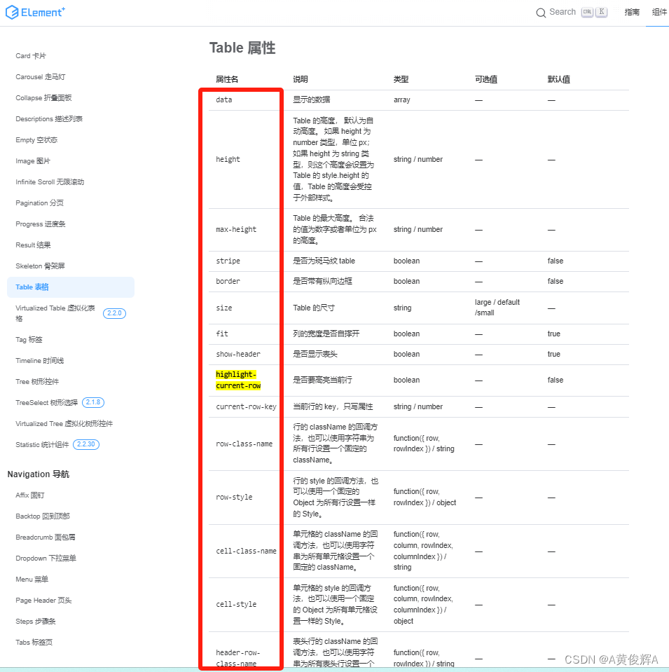
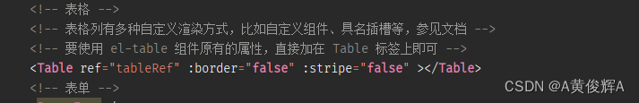
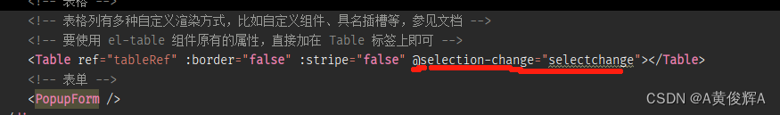
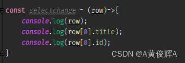

# Table组件，baTable类

## 属性

+ 在buildadmin 中，table组件是封装的 element-plus中的方法， 所以说， 在 buildadmin的table组件中，是可以通用 elementplus中的属性的

  

+ 以上这些属性， 在buildadmin中都是可以使用的
+ 使用方式和 elementplus el-table用法是一样的

  

## 方法

+ 直接使用方法， 需要通过 `getRef()`

  ```html
  <table ref="tableRef" />
  <script>
    const tableRef = ref();


    // 全选
    const allChsoose = () => {
      tableRef.value.getRef().toggleAllSelection();

      // 获取选中行
      setTimeout(() => {
        tableRef.value.getRef().getSelectionRows();
      })
    }
  </script>
  ```

## 事件监听

+ baTable 事件监听

  
  
  
