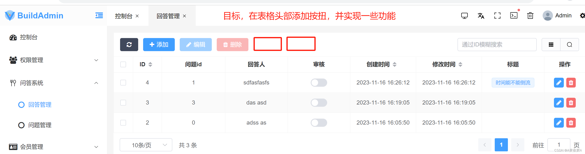
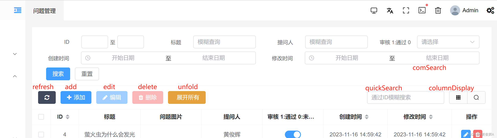
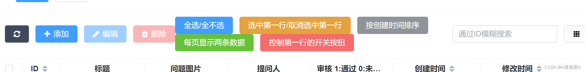

# 表头上方添加按钮和自定义按钮

## 默认按钮

+ buildAdmin 的表头上添加一些按钮，并实现功能

  

  ```html
  <template>
    <!-- buttons 属性定义了 TableHeader 本身支持的顶部按钮，仅需传递按钮名即可 -->
    <!-- 这里的框架自带的 顶部按钮  分别有 刷新 ， 添加， 编辑， 删除， 公共搜索 ， 快速搜索 ， 显示隐藏列，  -->
    <TableHeader
        :buttons="['refresh', 'add', 'edit', 'delete', 'comSearch', 'quickSearch', 'columnDisplay', 'unfold']"
        :quick-search-placeholder="t('Quick search placeholder', { fields: t('security.dataRecycleLog.Rule name') })"
    >
        <!-- 可以在此处以插槽的方式设置一些自定义按钮 -->
        <template #refreshPrepend>
            <!-- 刷新按钮前插槽内容 -->
        </template>

        <!-- 默认插槽 -->
        <template #default>
            <el-button v-blur :disabled="baTable.table.selection!.length > 0 ? false:true" class="table-header-operate" type="success">
                <Icon color="#ffffff" name="el-icon-RefreshRight" />
                <span class="table-header-operate-text">还原</span>
            </el-button>
        </template>

    </TableHeader>
  </template>

  <script>
  import TableHeader from '/@/components/table/header/index.vue'
  </script>
  ```

+ 表头上的默认按钮，只需要 在 button 数组中添加相应的名称就可以了

  

## 自定义表头按钮

+ 表格顶部的按钮，是通过表格组件中的插槽来添加的

  

  

https://blog.csdn.net/hjh15827475896/category_12502626.html
