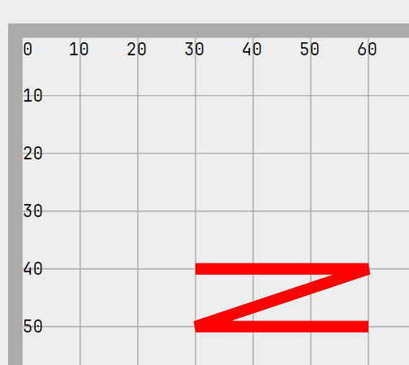

# 直线

## 直线

+ path 元素的形状是通过属性 `d` (draw: 绘制)定义的，属性d的值是一个“命令 + 参数”的序列

+ d属性

  + M 移动到("Move To" 设置笔触所在的起始位置（要从哪个坐标位置开始画）)
  + L 画直线到("Line To" 画一条直线到指定的坐标位置)
  + Z 闭合路径

## d属性之 M 或 m

+ M(Move to)命令：表示起点

  ```html
  <!-- (150,0) -->
  <path d="M 150 0"/>

  <!-- 或者 -->
  <path d="M150 0"/>
  ```

## d属性之 L 或 l

+ L命令(line to)

  ```html
  <!-- (150,0) -->
  <path d="M 150 0 l 75 200"/>

  <!-- 或者 -->
  <path d="M150 0 l75 200"/>
  ```

## 多个M与多个L

+  在一个path路径绘制的图形中，可以设置多个M，实现移动笔触，从多个点进行绘制
+  写成 `“M 10 10”` 或 `“M10 10”`

  ```html
  <path d="M40 30 L60 30 M30 50 L70 50 M50 30 L50 70"
      fill="none" stroke="#00f" stroke-width="2" />
  ```

  

+ 多个L

  ```html
  <path d="M30 40,L60 40, L30 50, L60 50"
      fill="none" stroke="red" stroke-width="2" />
  ```

  

## d属性之H h 和 V v

+ H 只需要指定横坐标， 表示横向画线
+ V 只需要指定纵坐标， 表示纵向画线
+ 这两个命令都只带一个参数，标明在 x 轴或 y 轴移动到的位置，因为它们都只在坐标轴的一个方向上移动

  ```
  H x
  (or)
  h dx

  V y
  (or)
  v dy
  ```

  ```html
  <!-- 画笔移动到 (10,10) 点，由此开始，向右移动 80 像素构成一条水平线，然后向下移动 80 像素，然后向左移动 80 像素，然后再回到起点 -->
  <path d="M10 10, h80 v80 h-80 Z" fill="transparent" stroke="red"/>
  ```

  ```html
  <path d="M30 30 H70 V70 H30"
      fill="none" stroke="#00f" stroke-width="2" />
  ```

  

## d属性之 Z 或 z 闭合路径

+ Z命令会从当前点画一条直线到路径的起点，尽管我们不总是需要闭合路径，但是它还是经常被放到路径的最后
+ 另外，Z 命令*不用区分大小写*

  ```html
 <path d="M30 30 H70 V70 H30 Z"
      fill="none" stroke="#00f" stroke-width="2" />
  ```

  
