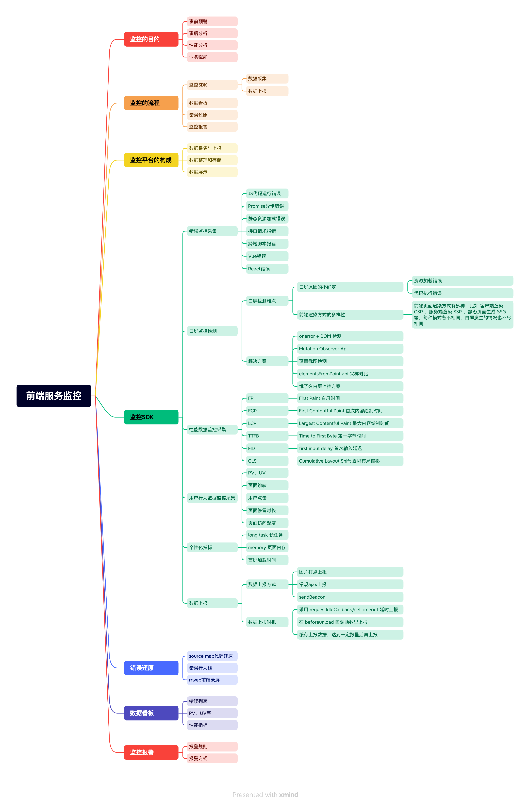

# 前端服务监控

## 概述

+ 前端监控的目的很明确，无非就是让我们的产品更完善，更符合我们和用户的需求
+ 运营与产品团队需要关注用户在产品内的行为记录，通过用户的行为记录来优化产品，研发与测试团队则需要关注产品的性能以及异常，确保产品的性能体验以及安全迭代

## 包含内容

+ 而一个完整的前端监控平台至少需要包括部分

  + 数据采集与上报
  + 数据整理和存储
  + 数据展示
  + 需要监控的项目

+ 也就是说，至少需要4个项目才能完整的记录前端监控的内容

  

## 名词解释
