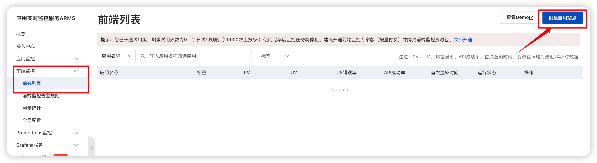
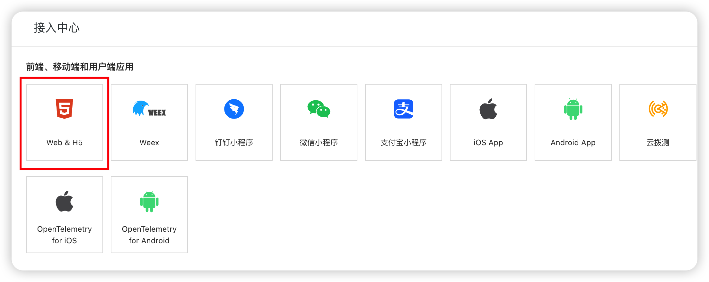
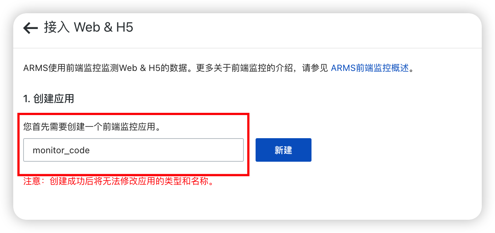
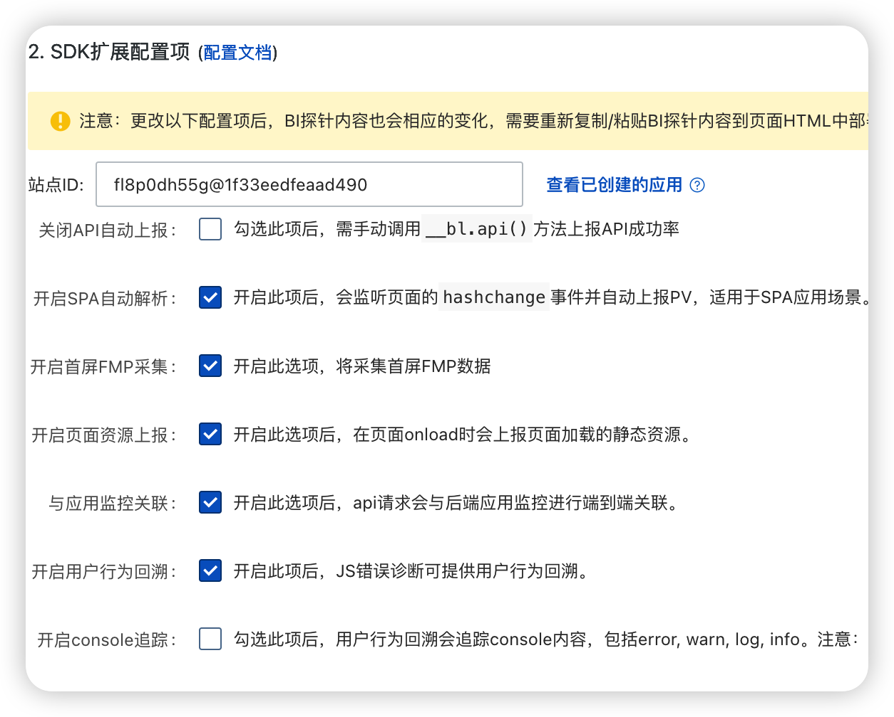
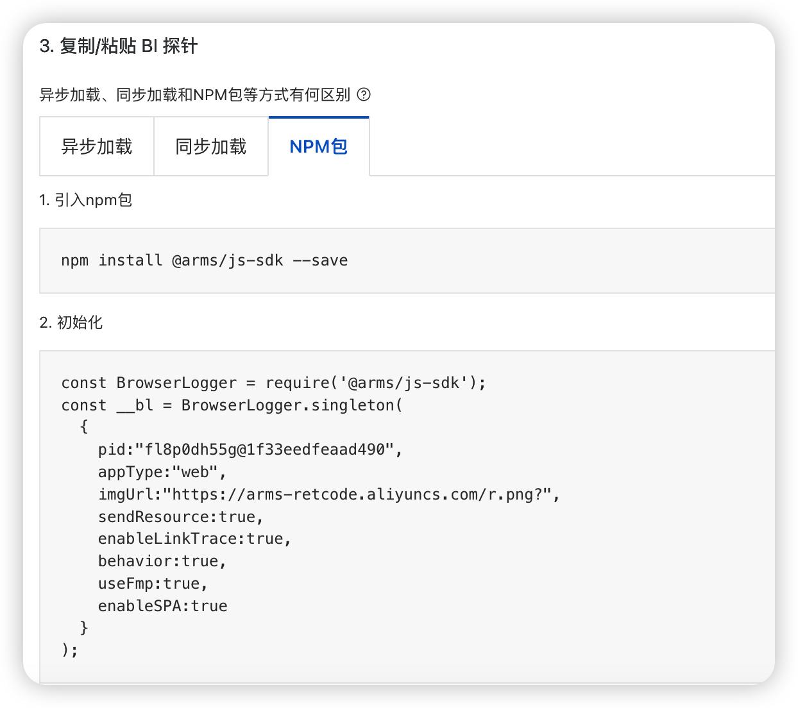
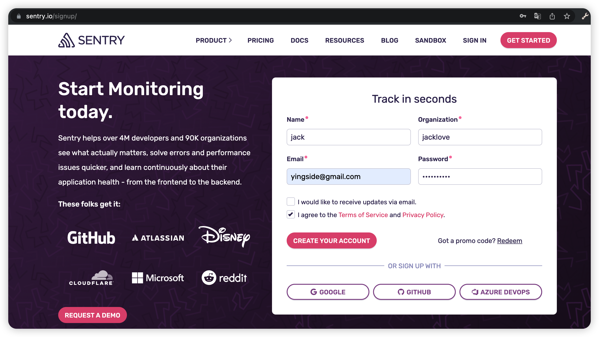
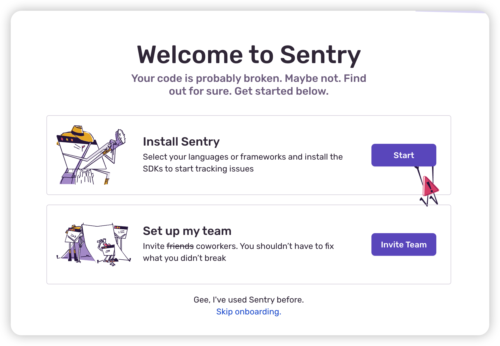
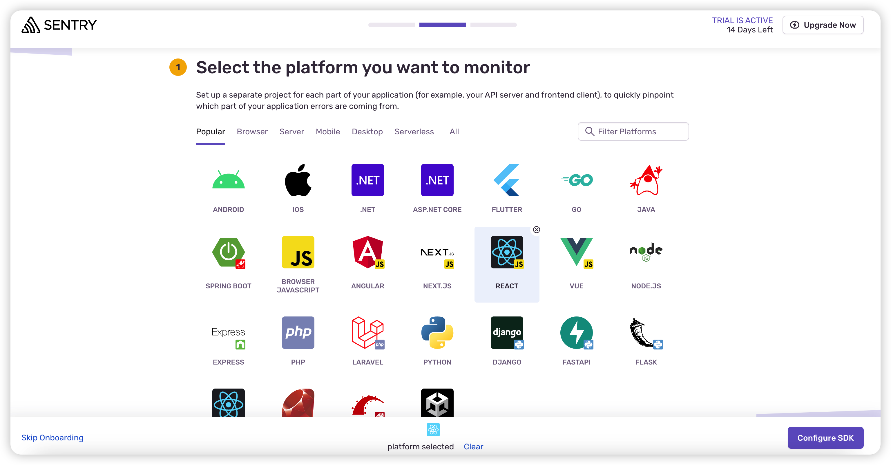
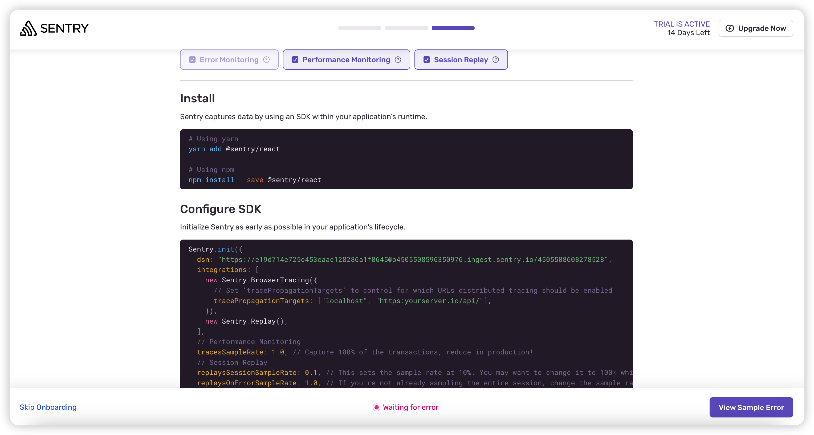
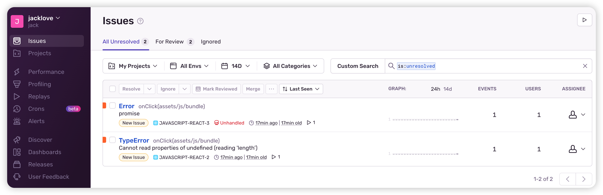

# 现成的平台

## 概述

1. sentry

2. 灯塔

3. 阿里ARMS

4. 神策

## 阿里ARMS基本使用

+ 阿里ARMS基本使用

  
  
  
  
  

## Sentry 基本使用

+ Sentry 基本使用

  
  
  
  

  ```bash
  // 安装
  npm install --save @sentry/react
  ```

  ```js
  //项目中配置SDK
  import * as Sentry from "@sentry/react";
  Sentry.init({
    dsn: "https://e19d714e725e453caac128286a1f0645@o4505508596350976.ingest.sentry.io/4505508608278528",
    integrations: [
      new Sentry.BrowserTracing({
        // Set 'tracePropagationTargets' to control for which URLs distributed tracing should be enabled
        tracePropagationTargets: ["localhost", "https:yourserver.io/api/"],
      }),
      new Sentry.Replay(),
    ],
    // Performance Monitoring
    tracesSampleRate: 1.0, // Capture 100% of the transactions, reduce in production!
    // Session Replay
    replaysSessionSampleRate: 0.1, // This sets the sample rate at 10%. You may want to change it to 100% while in development and then sample at a lower rate in production.
    replaysOnErrorSampleRate: 1.0, // If you're not already sampling the entire session, change the sample rate to 100% when sampling sessions where errors occur.
  });

  const container = document.getElementById(“app”);
  const root = createRoot(container);
  root.render(<App />)
  ```

  
