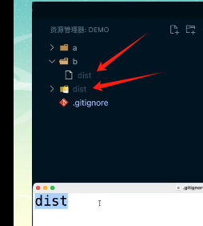
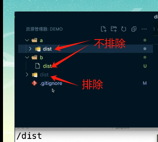
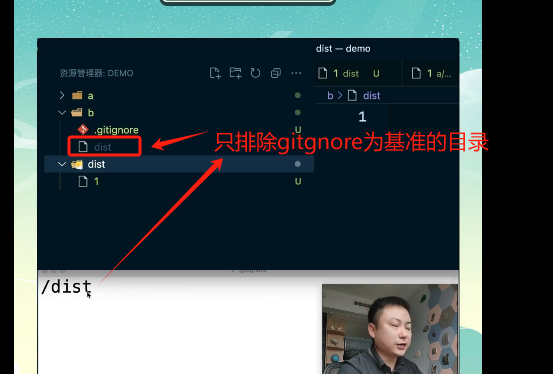

# 忽略文件配置

## .gitignore

1、配置语法:

> 以斜杠“/”开头表示目录；
>
> 以星号“*”通配多个字符；
>
> 以问号“?”通配单个字符
>
> 以方括号“[]”包含单个字符的匹配列表；
>
> 以叹号“!”表示不忽略(跟踪)匹配到的文件或目录；

此外，git 对于 .ignore 配置文件是按行从上到下进行规则匹配的，意味着如果前面的规则匹配的范围更大，则后面的规则将不会生效；

2、示例：

　　（1）规则：fd1/*
　　　　  说明：忽略目录 fd1 下的全部内容；注意，不管是根目录下的 /fd1/ 目录，还是某个子目录 /child/fd1/ 目录，都会被忽略；

　　（2）规则：/fd1/*
　　　　  说明：忽略根目录下的 /fd1/ 目录的全部内容；

　　（3）规则：

/*
!.gitignore
!/fw/bin/
!/fw/sf/

说明：忽略全部内容，但是不忽略 .gitignore 文件、根目录下的 /fw/bin/ 和 /fw/sf/ 目录；

## 直接书写单词

+ 直接书写单词

  ```
  // .gitignore
  dist

  // 匹配整个工程中，排除所有名称为dist的目录或者文件
  ```

  

## 带 /

+ 情况1 `/dist` 以 `.gitignore` 文件所在的目录为基准，排除 文件或目录

  
  

+ 情况2 `a/dist` 以 `.gitignore` 文件所在的目录为基准，排除 a 目录下的 dist 的文件或者 目录

  

+ 情况3 `/asd/`


