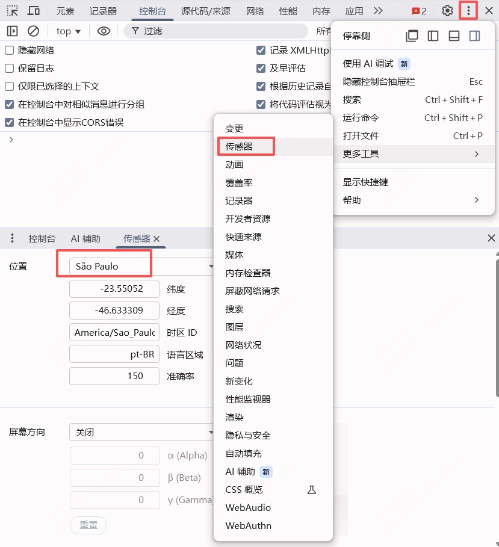

# 浏览器

## Console Importer 插件

+ 在浏览器控制台中直接使用 npm 插件

  ```shell
  $i('jquery)

  $i('lodash')
  ```

  

## 让浏览器使用独立显卡

+ Windows设置 - 左侧“系统”，右侧“屏幕” - 显示卡（可以在设置里搜索“图形设置”）

+ 应用列表里如果没有Google Chrome，就点“浏览”按钮，一般在C:\Program Files\Google\Chrome\Application路径下找到chrome.exe，添加进来

  

+ 点击Google Chrome图标，点击“选项”按钮，在弹出窗口如下选择“高性能”，然后“保存”，就完事了

  


## 切换浏览器位置

+ 切换位置

  + 
