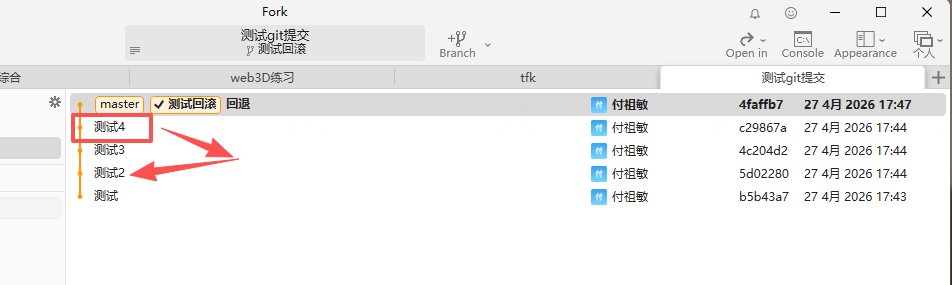

# 回滚某个提交

## 概述

+ 回滚某个提交

  ```bash
  # restore 覆盖、重新存储
  # source 工作区
  # `提交id .` 用某一次提交的id覆盖 当前工作区
  git restore --source 提交id . # 将指定的提交覆盖到当前工作区根目录
  ```

+ 使用上述命令时，要确保工作区干净（暂存区没东西，工作区无更改）

+ 提交id

  


## 示例

+ 示例1: 提交记录a->b->c->d 现在想从d回退到b的状态

  ```bash
  # 从 测试4这次提交，回滚到 测试2 这次提交（测试2 提交id）
  git restore --source 5d02280 .
  ```

  
