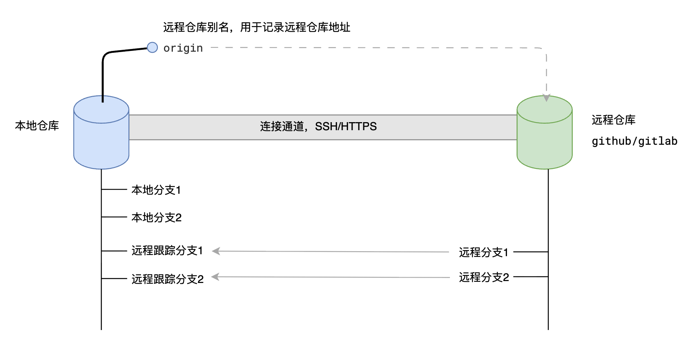

# 远程仓库、别名、克隆

## 仓库和别名

+ 要和远程仓库同步，先得有远程仓库

  1. 在github中创建远程仓库

  2. 在本地仓库中添加远程仓库的别名

  

## 别名常见操作

+ 查看当前的远程仓库别名

  ```bash
  # 查看当前的远程仓库别名
  git remote    	# 简要信息
  git remote -v  	# 详细信息
  ```

+ 添加别名

  ```bash
  # 添加别名
  git remote add 远程仓库别名 远程仓库ssh地址

  # 例如
  git remote add origin git@github.com:xgg217/Note.git
  ```

+ 修改别名

  ```bash
  # 修改别名
  git remote rename 原别名 新别名
  ```

+ 删除别名

  ```bash
  # 删除别名
  git remote remove 要删除的别名
  ```

## 克隆

+ 当本地没有工程时，可以使用git clone操作快速完成远程仓库的下载

  ```bash
  git clone [-b 分支名] 远程仓库地址 [想要保存的文件夹]

  # 保存到本地文件夹 demo2
  git clone 远程仓库地址 ./demo2
  ```

