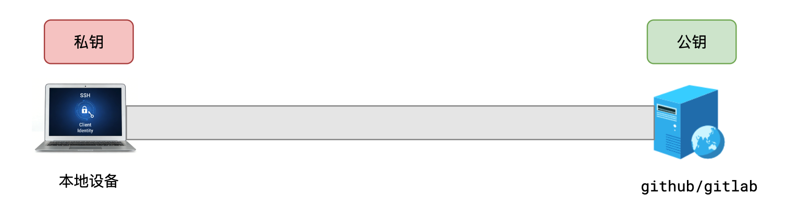
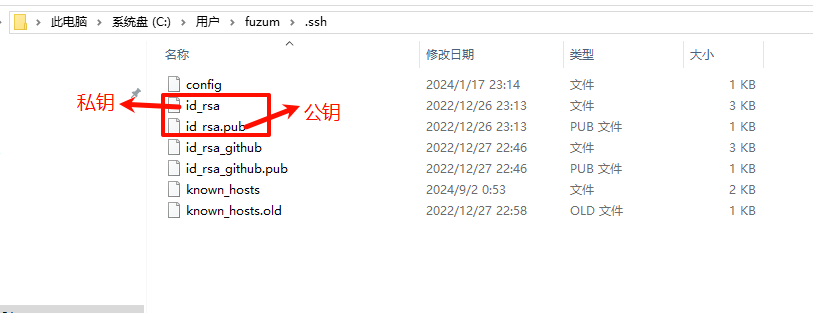
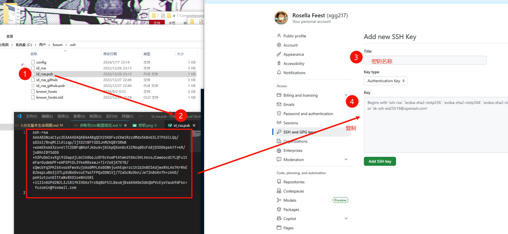

# 多账号SSH配置规范

## SSH连接通道配置

+ SSH连接通道配置

  

## 步骤

+ 步骤1：本地生成密钥对

  + windows电脑必须打开powershell，而不是普通终端

  + mac电脑随意

  ```bash
  ssh-keygen -t ed25519 -C "注册github的邮箱地址" -f ~/.ssh/xxx_github_key

  # 例如
  ssh-keygen -t ed25519 -C "1326580471@qq.com" -f ~/.ssh/fuzumin_github_key
  ```

+ 步骤2：命令后续交互保持默认即可
+ 步骤3：生成完后，到电脑的 `~/.ssh` 目录即可看到之前生成的两个文件

  + windows电脑的位置在 `c:/Users/你的用户名/.ssh`

  ```text
  xxx_github_key      # 这是私钥
  xxx_github_key.pub  # 这是公钥
  ```

  

+ 步骤4: 到github配置公钥 `https://github.com/settings/keys`

  
