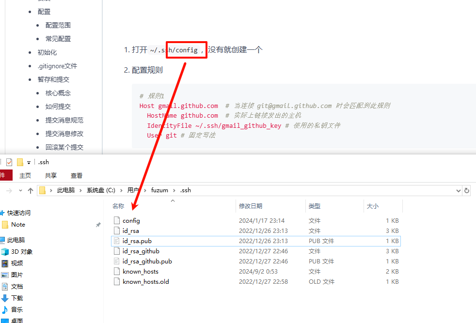
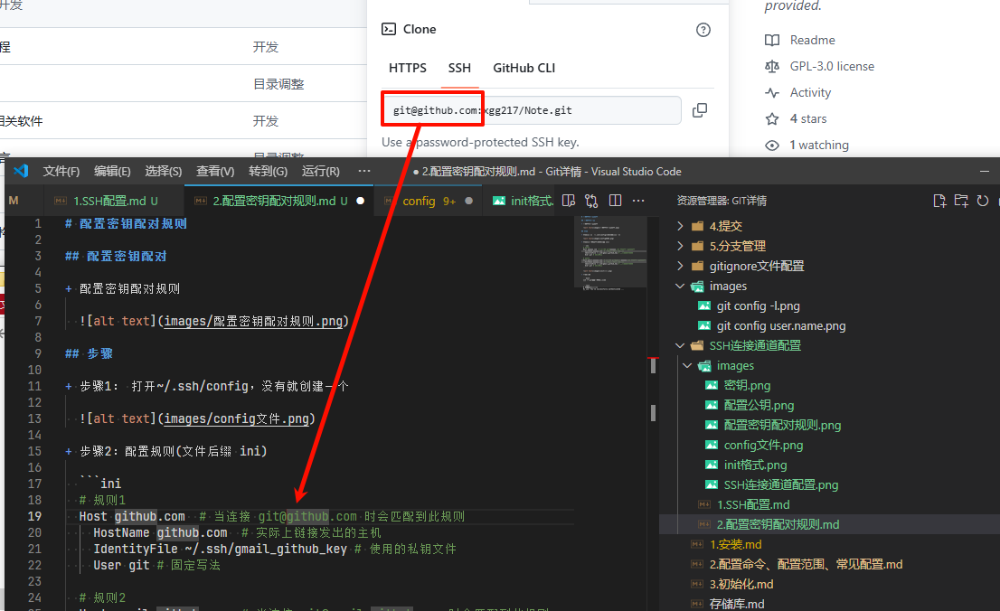

# 配置密钥配对规则

## 配置密钥配对

+ 配置密钥配对规则

  

## 步骤

+ 步骤1： 打开 `~/.ssh/config` 没有就创建一个

  

+ 步骤2：配置规则(文件后缀 ini)

  ```ini
  # 规则1
  Host github.com # 当连接 git@github.com 时会匹配到此规则
    Hostname ssh.github.com # 实际上链接发出的主机
    PreferredAuthentications publickey  # 实际上链接发出的主机
    IdentityFile ~/.ssh/id_rsa # 使用的私钥文件
    Port 443
    User git # 固定写法

  # 规则2
  Host gmail.github.com  # 当连接 git@gmail.github.com 时会匹配到此规则
    HostName github.com  # 实际上链接发出的主机
    IdentityFile ~/.ssh/gmail_github_key # 使用的私钥文件
    User git # 固定写法
  ```

  
  

+ 测试连接

  ```bash
  ssh -T git@你配置的主机名

  # 例如
  ssh -T git@github.com
  ```

  ```text
  # 成功的结果是：
  Hi xxx! You've successfully authenticated ...
  ```
