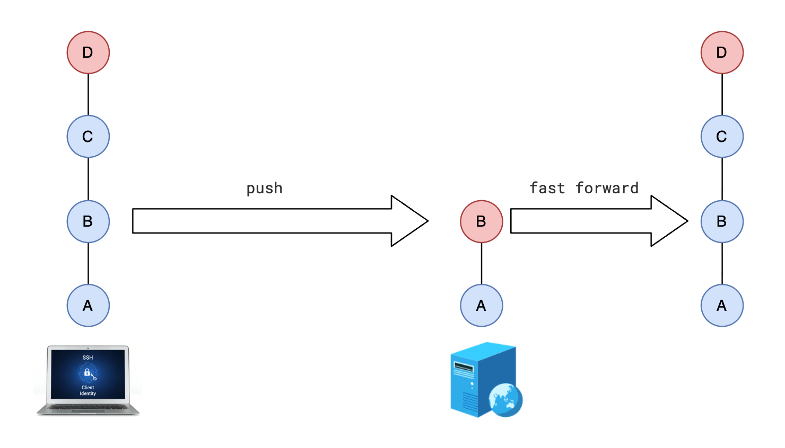
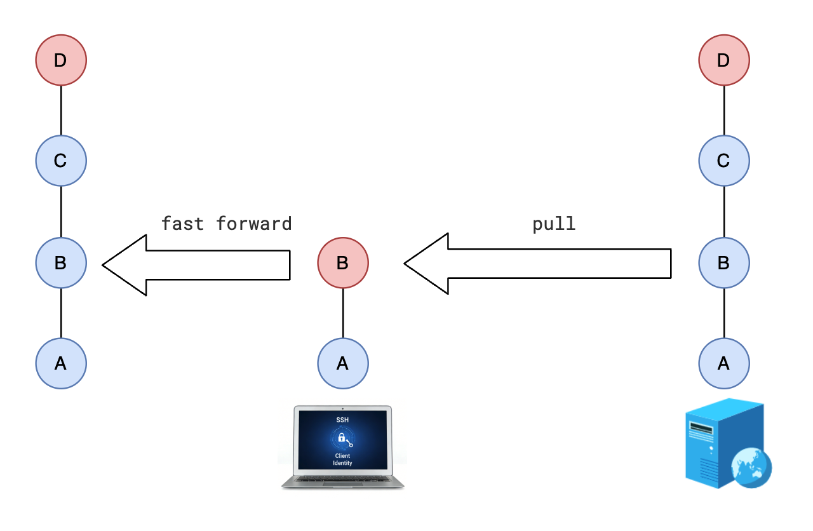
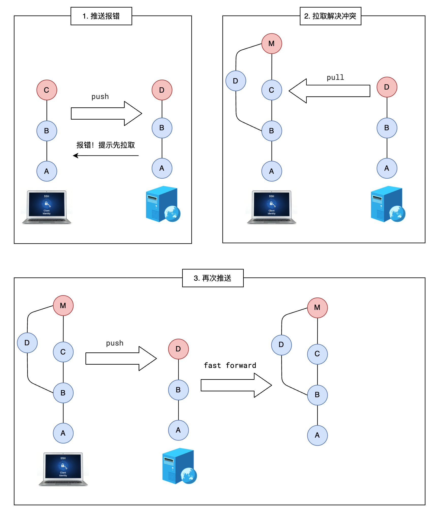

# 同步的三种情况

## 情况1 远程快进

+ 本地分支超前（本地分支开发进度比远程快）

  

## 情况2 本地快进

+ 远程的分支超前（远程分支开发进度比本地快）

  

## 情况3 解决冲突

+ 解决冲突

  

  ```bash
  # 推送失败
  git push

  # 解决方式

  # 第一步 本地跟踪分支(origin/mian)与远程分支同步
  git fetch origin main

  # 第二步 合并
  git merge origin/main

  # 第三步 本地解决冲突

  # 第四步 推送本地（如果发现继续冲突，回到第一步）
  ```
