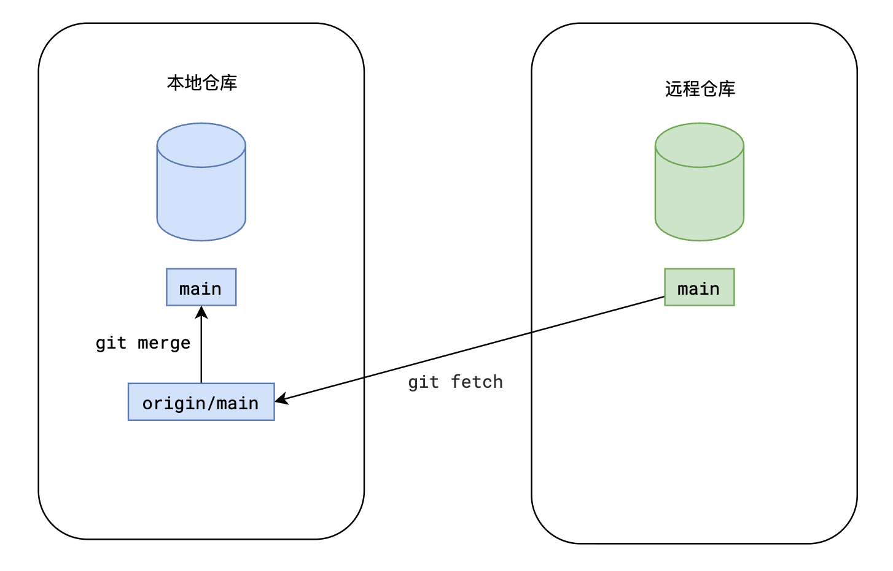

# 拉 pull命令

## pull

+ pull

  

## 方式1

+ 步骤1：使用git fetch命令(如果本地没有跟踪分支，则创建跟踪分支)

  ```bash
  git fetch 远程仓库别名 远程分支名

  # 例如
  git fetch origin main
  ```

+ 步骤2：使用git merge命令合并分支

  ```bash
  # 确保当前在对应分支上
  git merge 本地跟踪分支名

  # 例如
  git merge origin/main

  # 或
  git merge origin/master
  ```

+ 这样，就完成了远程到本地的同步

## 方式2

+ 使用 `git pull` 快捷命令，可以一步替代上面两步操作

  ```bash
  git pull 远程仓库别名 远程分支

  # 例如
  git pull origin main
  ```
