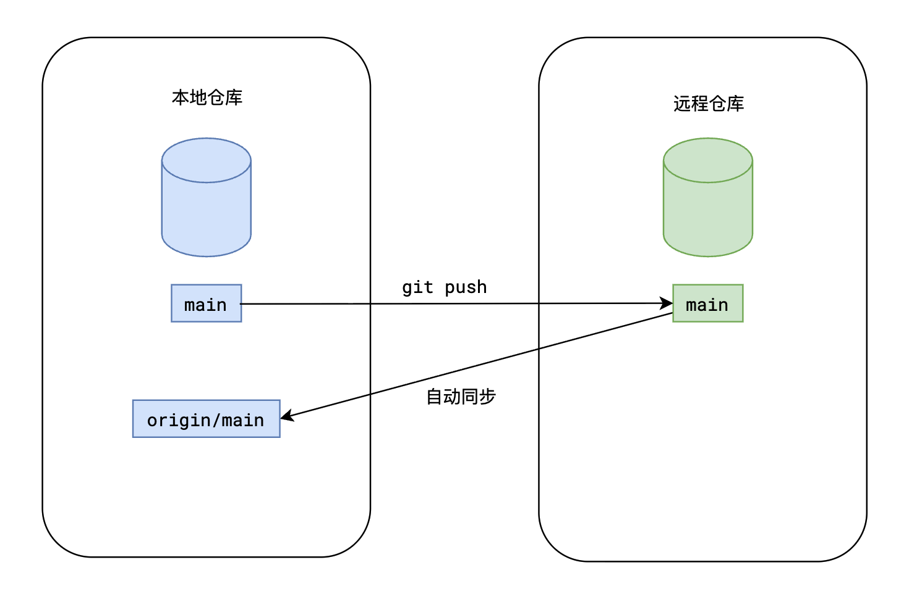

# 推 push命令

## push

+ push

  ```bash
  # 将本地的某个分支推送到指定仓库
  git push -u 远程仓库别名 本地分支名
  ```

  

## 细节

+ 如果远程没有相关分支，则在远程创建同名分支

+ 推送完成后，会在本地创建远程跟踪分支

  + 跟踪分支自动命名：仓库别名/分支名
  + 跟踪分支是只读的，它的目的在于同步远程分支
  + 推送完成后，会自动同步远程跟踪分支

+ 由于使用了参数-u，在跟踪分支创建后，会自动把本地分支main绑定到跟踪分支origin/main

  + 后续仅需要使用 `git push` 即可推送当前的main分支
