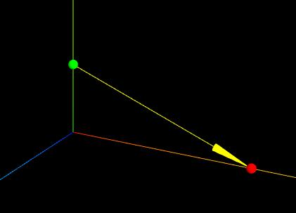

# 箭头 ArrowHelper

## 概述

+ 用于模拟方向的3维箭头对象

  

  ```js
  const dir = new THREE.Vector3( 1, 2, 0 );

  dir.normalize();

  const origin = new THREE.Vector3( 0, 0, 0 );
  const length = 1;
  const hex = 0xffff00;

  const arrowHelper = new THREE.ArrowHelper( dir, origin, length, hex );
  scene.add( arrowHelper );
  ```

## 构造函数

+ `ArrowHelper(dir : Vector3, origin : Vector3, length : Number, hex : Number, headLength : Number, headWidth : Number )`

  + `dir` -- 基于箭头原点的方向 必须为 *单位向量*(可以使用 `normalize()` )
  + `origin` -- 箭头的原点
  + `length` -- 箭头的长度 默认为 1
  + `hex` -- 定义的16进制颜色值. 默认为 0xffff00
  + `headLength` -- 箭头头部(锥体)的长度 默认为箭头长度的0.2倍(0.2 *length)
  + `headWidth` -- 箭头头部的宽度 默认值为0.2*headLength

## 示例

+ 两个小球可视化A、B两点位置

  ```js
  const A = new THREE.Vector3(0, 30, 0);//A点
  const B = new THREE.Vector3(80, 0, 0);//B点

  // 绿色小球可视化A点位置
  const AMesh = createSphereMesh(0x00ff00,2);
  AMesh.position.copy(A);
  // 红色小球可视化B点位置
  const BMesh = createSphereMesh(0xff0000,2);
  BMesh.position.copy(B);

  const group = new THREE.Group();
  group.add(AMesh,BMesh);

  function createSphereMesh(color,R) {
    const geometry = new THREE.SphereGeometry(R);
    const material = new THREE.MeshLambertMaterial({
        color: color,
    });
    const mesh = new THREE.Mesh(geometry, material);
    return mesh;
  }
  ```

+ 生成一个A指向B的箭头

  ```js
  // 绘制一个从A指向B的箭头
  const AB = B.clone().sub(A);
  const L = AB.length();//AB长度
  const dir = AB.clone().normalize();//单位向量表示AB方向

  // 生成箭头从A指向B
  const arrowHelper = new THREE.ArrowHelper(dir, A, L)
  group.add(arrowHelper);
  ```

  
