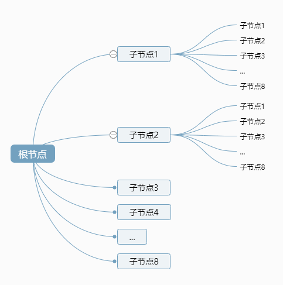

# 八叉树Octree扩展库介绍

## 概述

+ 学习八叉树 `Octree` 目的，是为了实现漫游的碰撞检测功能，比如遇到装障碍物被挡住、比如爬坡和上楼梯

  ```js
  // 引入八叉树扩展库
  import { Octree } from 'three/examples/jsm/math/Octree.js';

  const worldOctree = new Octree();
  // 分割模型，生成八叉树节点
  worldOctree.fromGraphNode(模型对象);
  ```

## 八叉树基本原理解释

+ 网格模型Mesh本质是由三角形构成，三角形由顶点构成，这些三角形和自己的顶点数据分布在3D空间中

  ```js
  const geometry = new THREE.BoxGeometry(50,50,50);
  console.log('顶点位置数据',geometry.attributes.position);
  console.log('三角形顶点索引数据',geometry.index);
  ```

  

+ 如果整个3D模型用一个长方体空间来表示，在三维空间xyz三个方向，都分割一次，这样就可以得到8个小的长方体子空间

  

+ 一个3D模型的三角形(顶点)分布在三维空间中，如果你用一个长方体来表示整个3d场景，当你分割为8个子空间的时候，每个子空间可以包含对应的三角形(顶点)数据。

+ 每个子空间如果三角形(顶点)数量比较多，还可以继续分割，具体分割规则，你可以自定义，比如你可以规定，一个子空间包含的三角形数量只要大于8个就继续分割
+ 这样一个个子空间可以构成一个树结构，整体来看，每个节点，分叉出来八个子节点

  
