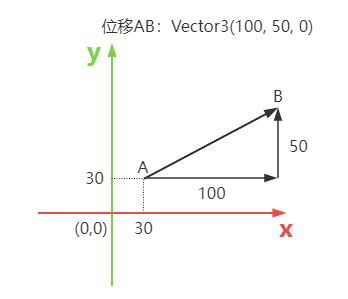

# Vector3 位移向量

## 位移量(向量)

+ 比如已知人在3D空间中的坐标A点是(30,30,0)
+ 此人运动到B点，从A到B的位移变化量可以用一个向量 `Vector3` 表示
+ 已知AB在x轴上投影长度是100，y方向投影长度是50，这个变化可以用三维向量 `THREE.Vector3(100,50,0)` 表示
+ 换句话说，你也可以理解为人沿着x轴走了100，沿着y方向走了50，到达B点

  

  ```js
  const A = new THREE.Vector3(30, 30, 0);// 人起点A

  // walk表示运动的位移量用向量
  const walk = new THREE.Vector3(100, 50, 0);
  const B = new THREE.Vector3(); // 人运动结束点B

  // 计算结束点xyz坐标
  B.x = A.x + walk.x;
  B.y = A.y + walk.y;
  B.z = A.z + walk.z;
  console.log('B',B);
  ```
