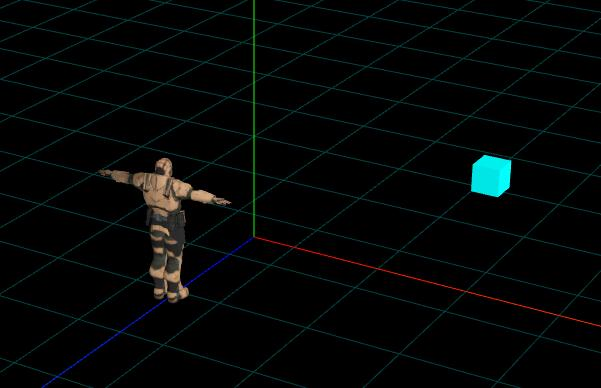

# 点乘判断物体在人前或人后

## 概述

+ 通过three.js向量Vector3点乘方法 `.dot()` 判断物体在人的前面还是后面

## 已知条件

+ 人的正前方沿着z轴负半轴方向

  ```js
  // a向量：人的正前方沿着z轴负半轴
  const a = new THREE.Vector3(0,0,-1);
  ```

+ 人的位置和物体的位置

  ```js
  person.position.set(0,0,2);//人位置
  mesh.position.set(2,0,-3);//物体位置
  ```

  

## 创建一个人指向物体的向量

+ 物体坐标减去人坐标，创建一个人指向物体的向量

  ```js
  const b = mesh.position.clone().sub(person.position);
  ```

## 向量夹角与人前后关系判断

+ 物体绕着人360挪动位置，你创建不同位置人指向物体的向量b，你会发现向量b与向量a的夹角处于0~180度之间

  ```js
  // a向量：人的正前方
  const a = new THREE.Vector3(0,0,-1);
  // 人指向物体的向量
  const b = mesh.position.clone().sub(person.position);
  ```

+ 0 ~ 90度：物体在人的前方,人指向物体的向量b与人正前方向量a夹角处于0 ~ 90之间

+ 90 ~ 180度：物体在人的后方，人指向物体的向量b与人正前方向量a夹角处于90 ~ 180之间

  
