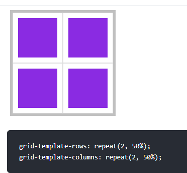

# 重复设置 repeat

## 关键词 repeat

+ 使用 `repeat` 统一设置值

  + 第一个参数为重复数量
  + 第二个参数是重复值

## 示例

+ 示例1

  ```css
  grid-template-rows: repeat(2, 50%); /* 2行，每行高度占比 50% */
  grid-template-columns: repeat(2, 50%);
  ```

  

+ 示例2：可以设置多个值来定义重复，下面定义了四列，以 100%、20px 重复排列

  ```css
  display: grid;
  grid-template-rows: repeat(2, 50%);
  grid-template-columns: repeat(2, 100px 50px);
  ```

  
